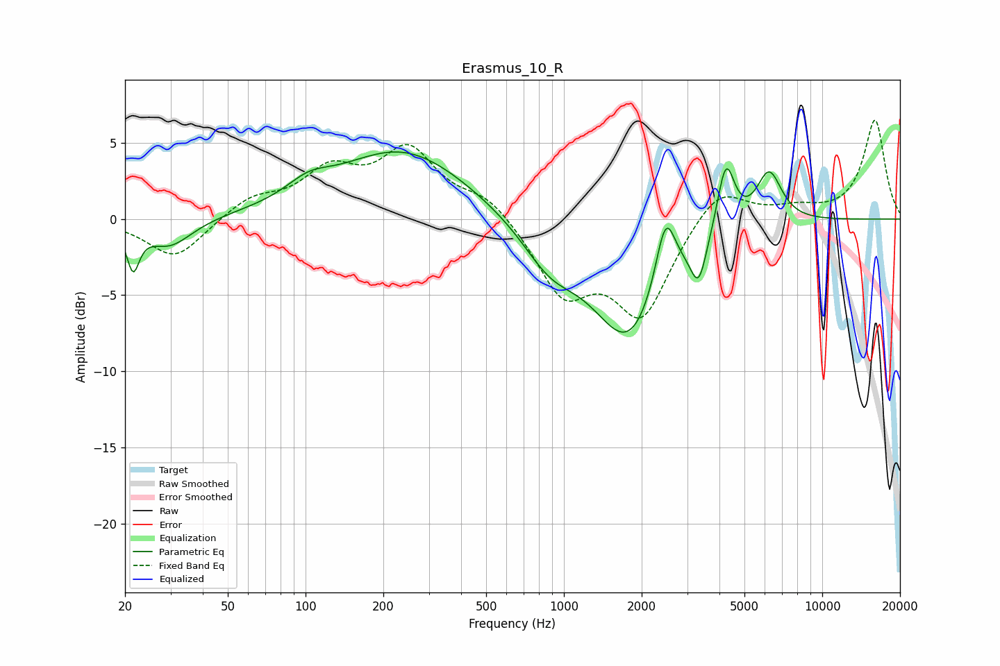

# Erasmus_10_R
See [usage instructions](https://github.com/jaakkopasanen/AutoEq#usage) for more options and info.

### Parametric EQs
Apply preamp of -4.5 dB when using parametric equalizer.

|   # | Type    |   Fc (Hz) |    Q |   Gain (dB) |
|-----|---------|-----------|------|-------------|
|   1 | Peaking |        21 | 5.98 |        -2.7 |
|   2 | Peaking |        30 | 1.6  |        -1.9 |
|   3 | Peaking |       103 | 1.67 |         1.1 |
|   4 | Peaking |       238 | 0.56 |         4.6 |
|   5 | Peaking |       882 | 1.31 |        -2.4 |
|   6 | Peaking |      1791 | 0.98 |        -7.9 |
|   7 | Peaking |      2473 | 3.54 |         4.9 |
|   8 | Peaking |      3323 | 4.62 |        -2.8 |
|   9 | Peaking |      4236 | 4.11 |         4.6 |
|  10 | Peaking |      6224 | 2.76 |         3.4 |

### Fixed Band EQs
When using fixed band (also called graphic) equalizer, apply preamp of **-6.6 dB** (if available) and set gains manually with these parameters.

|   # | Type    |   Fc (Hz) |    Q |   Gain (dB) |
|-----|---------|-----------|------|-------------|
|   1 | Peaking |        31 | 1.41 |        -2.6 |
|   2 | Peaking |        62 | 1.41 |         1.3 |
|   3 | Peaking |       125 | 1.41 |         2.8 |
|   4 | Peaking |       250 | 1.41 |         4.3 |
|   5 | Peaking |       500 | 1.41 |         1.5 |
|   6 | Peaking |      1000 | 1.41 |        -4.7 |
|   7 | Peaking |      2000 | 1.41 |        -6.1 |
|   8 | Peaking |      4000 | 1.41 |         2.4 |
|   9 | Peaking |      8000 | 1.41 |         0.6 |
|  10 | Peaking |     16000 | 1.41 |         6.5 |

### Graphs

