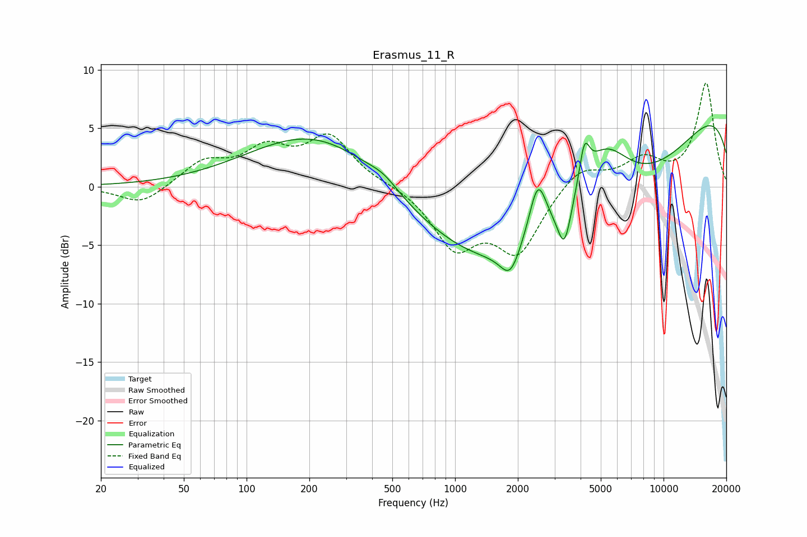

# Erasmus_11_R
See [usage instructions](https://github.com/jaakkopasanen/AutoEq#usage) for more options and info.

### Parametric EQs
Apply preamp of -5.3 dB when using parametric equalizer.

|   # | Type    |   Fc (Hz) |    Q |   Gain (dB) |
|-----|---------|-----------|------|-------------|
|   1 | Peaking |       220 | 0.44 |         4.9 |
|   2 | Peaking |       454 | 2.06 |         0.7 |
|   3 | Peaking |      1837 | 3.08 |        -2.3 |
|   4 | Peaking |      2495 | 3.27 |         5.1 |
|   5 | Peaking |      2932 | 0.19 |        -4.5 |
|   6 | Peaking |      3345 | 4.49 |        -3.6 |
|   7 | Peaking |      3829 | 0.24 |        -7.3 |
|   8 | Peaking |      4173 | 5.72 |         3.4 |
|   9 | Peaking |      5141 | 1.08 |         6.1 |
|  10 | Peaking |     10000 | 0.18 |         9.1 |

### Fixed Band EQs
When using fixed band (also called graphic) equalizer, apply preamp of **-9.0 dB** (if available) and set gains manually with these parameters.

|   # | Type    |   Fc (Hz) |    Q |   Gain (dB) |
|-----|---------|-----------|------|-------------|
|   1 | Peaking |        31 | 1.41 |        -1.6 |
|   2 | Peaking |        62 | 1.41 |         2   |
|   3 | Peaking |       125 | 1.41 |         2.8 |
|   4 | Peaking |       250 | 1.41 |         4.1 |
|   5 | Peaking |       500 | 1.41 |         0.2 |
|   6 | Peaking |      1000 | 1.41 |        -4.9 |
|   7 | Peaking |      2000 | 1.41 |        -5.4 |
|   8 | Peaking |      4000 | 1.41 |         1.9 |
|   9 | Peaking |      8000 | 1.41 |         2.2 |
|  10 | Peaking |     16000 | 1.41 |         8.8 |

### Graphs

