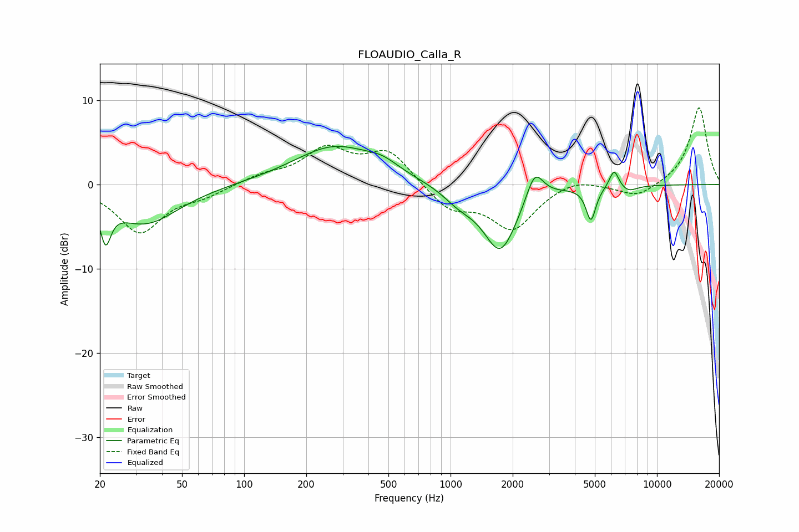

# FLOAUDIO_Calla_R
See [usage instructions](https://github.com/jaakkopasanen/AutoEq#usage) for more options and info.

### Parametric EQs
Apply preamp of -4.6 dB when using parametric equalizer.

|   # | Type    |   Fc (Hz) |    Q |   Gain (dB) |
|-----|---------|-----------|------|-------------|
|   1 | Peaking |        21 | 5.69 |        -4.4 |
|   2 | Peaking |        33 | 0.87 |        -4.6 |
|   3 | Peaking |       274 | 0.71 |         4.5 |
|   4 | Peaking |       468 | 1.78 |         1.1 |
|   5 | Peaking |      1099 | 1.82 |        -1.5 |
|   6 | Peaking |      1742 | 1.67 |        -7.9 |
|   7 | Peaking |      2557 | 3.36 |         3.7 |
|   8 | Peaking |      4787 | 5.92 |        -4   |
|   9 | Peaking |      6201 | 5.95 |         2.3 |
|  10 | Peaking |      7254 | 3.24 |        -0.7 |

### Fixed Band EQs
When using fixed band (also called graphic) equalizer, apply preamp of **-9.2 dB** (if available) and set gains manually with these parameters.

|   # | Type    |   Fc (Hz) |    Q |   Gain (dB) |
|-----|---------|-----------|------|-------------|
|   1 | Peaking |        31 | 1.41 |        -5.6 |
|   2 | Peaking |        62 | 1.41 |        -1.1 |
|   3 | Peaking |       125 | 1.41 |         1   |
|   4 | Peaking |       250 | 1.41 |         4   |
|   5 | Peaking |       500 | 1.41 |         3.9 |
|   6 | Peaking |      1000 | 1.41 |        -2.9 |
|   7 | Peaking |      2000 | 1.41 |        -5.1 |
|   8 | Peaking |      4000 | 1.41 |         1   |
|   9 | Peaking |      8000 | 1.41 |        -1.6 |
|  10 | Peaking |     16000 | 1.41 |         9.2 |

### Graphs

