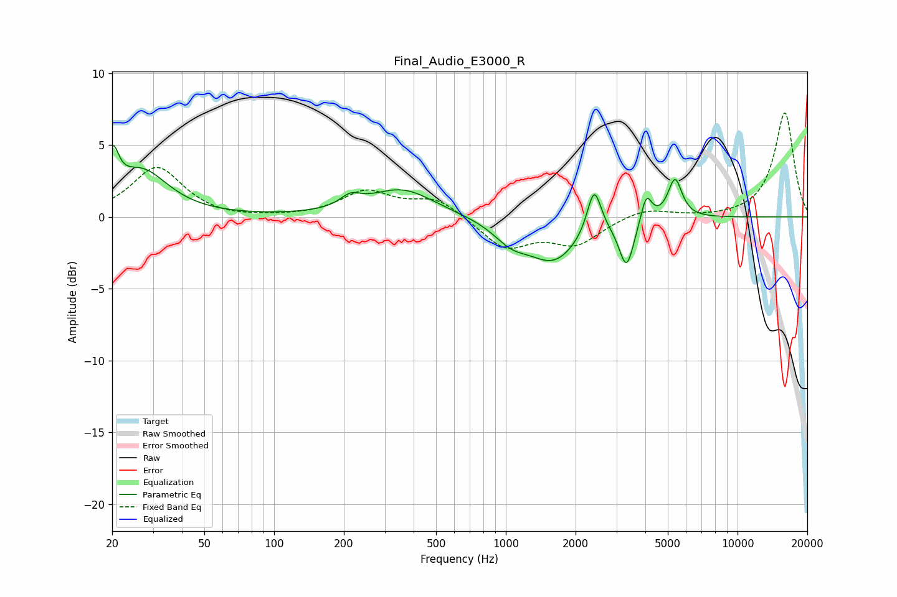

# Final_Audio_E3000_R
See [usage instructions](https://github.com/jaakkopasanen/AutoEq#usage) for more options and info.

### Parametric EQs
Apply preamp of -5.0 dB when using parametric equalizer.

|   # | Type    |   Fc (Hz) |    Q |   Gain (dB) |
|-----|---------|-----------|------|-------------|
|   1 | Peaking |        20 | 5.79 |         2.9 |
|   2 | Peaking |        27 | 1.25 |         3.1 |
|   3 | Peaking |       214 | 3.19 |         0.8 |
|   4 | Peaking |       355 | 1    |         1.9 |
|   5 | Peaking |      1055 | 1.86 |        -1.2 |
|   6 | Peaking |      1611 | 1.28 |        -2.9 |
|   7 | Peaking |      2405 | 4.72 |         3.2 |
|   8 | Peaking |      3320 | 4.42 |        -3.3 |
|   9 | Peaking |      4039 | 6    |         1.9 |
|  10 | Peaking |      5371 | 4.64 |         2.8 |

### Fixed Band EQs
When using fixed band (also called graphic) equalizer, apply preamp of **-7.3 dB** (if available) and set gains manually with these parameters.

|   # | Type    |   Fc (Hz) |    Q |   Gain (dB) |
|-----|---------|-----------|------|-------------|
|   1 | Peaking |        31 | 1.41 |         3.5 |
|   2 | Peaking |        62 | 1.41 |        -0.2 |
|   3 | Peaking |       125 | 1.41 |        -0   |
|   4 | Peaking |       250 | 1.41 |         1.7 |
|   5 | Peaking |       500 | 1.41 |         1.3 |
|   6 | Peaking |      1000 | 1.41 |        -2.1 |
|   7 | Peaking |      2000 | 1.41 |        -1.8 |
|   8 | Peaking |      4000 | 1.41 |         0.6 |
|   9 | Peaking |      8000 | 1.41 |        -0.1 |
|  10 | Peaking |     16000 | 1.41 |         7.3 |

### Graphs

