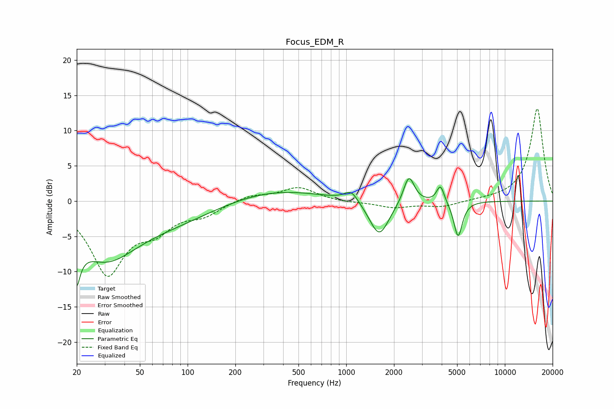

# Focus_EDM_R
See [usage instructions](https://github.com/jaakkopasanen/AutoEq#usage) for more options and info.

### Parametric EQs
Apply preamp of -3.3 dB when using parametric equalizer.

|   # | Type    |   Fc (Hz) |    Q |   Gain (dB) |
|-----|---------|-----------|------|-------------|
|   1 | Peaking |        20 | 5.57 |        -9.3 |
|   2 | Peaking |        20 | 5.98 |         3.3 |
|   3 | Peaking |        30 | 0.68 |        -7.6 |
|   4 | Peaking |        87 | 0.52 |        -2.1 |
|   5 | Peaking |       347 | 0.47 |         1.7 |
|   6 | Peaking |      1077 | 3.25 |         1.6 |
|   7 | Peaking |      1615 | 2.29 |        -5.1 |
|   8 | Peaking |      2483 | 4.12 |         4   |
|   9 | Peaking |      3927 | 6    |         2.5 |
|  10 | Peaking |      5070 | 5.3  |        -5.1 |

### Fixed Band EQs
When using fixed band (also called graphic) equalizer, apply preamp of **-13.2 dB** (if available) and set gains manually with these parameters.

|   # | Type    |   Fc (Hz) |    Q |   Gain (dB) |
|-----|---------|-----------|------|-------------|
|   1 | Peaking |        31 | 1.41 |       -10   |
|   2 | Peaking |        62 | 1.41 |        -3.2 |
|   3 | Peaking |       125 | 1.41 |        -1.7 |
|   4 | Peaking |       250 | 1.41 |         0.9 |
|   5 | Peaking |       500 | 1.41 |         1.9 |
|   6 | Peaking |      1000 | 1.41 |        -0.2 |
|   7 | Peaking |      2000 | 1.41 |        -0.9 |
|   8 | Peaking |      4000 | 1.41 |        -0.8 |
|   9 | Peaking |      8000 | 1.41 |         0.1 |
|  10 | Peaking |     16000 | 1.41 |        13.2 |

### Graphs

