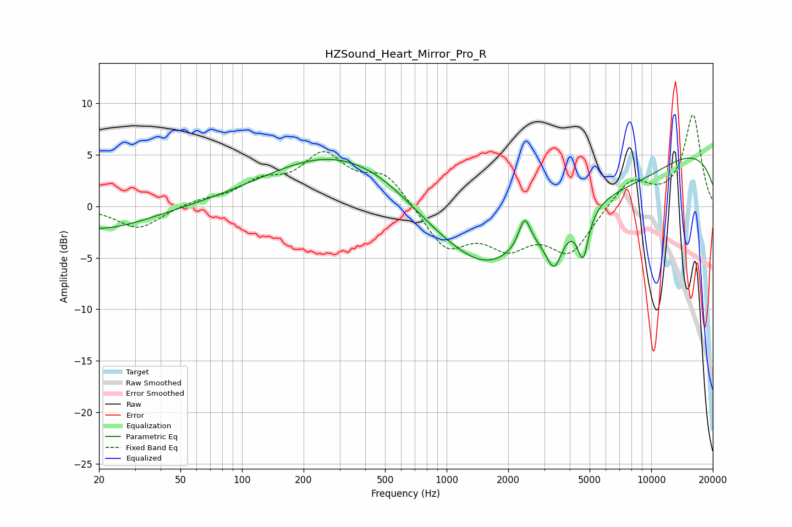

# HZSound_Heart_Mirror_Pro_R
See [usage instructions](https://github.com/jaakkopasanen/AutoEq#usage) for more options and info.

### Parametric EQs
Apply preamp of -4.8 dB when using parametric equalizer.

|   # | Type    |   Fc (Hz) |    Q |   Gain (dB) |
|-----|---------|-----------|------|-------------|
|   1 | Peaking |        20 | 0.57 |        -2.3 |
|   2 | Peaking |       284 | 0.43 |         5.2 |
|   3 | Peaking |       509 | 0.73 |         1.5 |
|   4 | Peaking |      1591 | 0.82 |        -2.8 |
|   5 | Peaking |      2004 | 0.25 |        -5.8 |
|   6 | Peaking |      2407 | 4.95 |         3   |
|   7 | Peaking |      3355 | 3.39 |        -4   |
|   8 | Peaking |      4643 | 5.15 |        -4.4 |
|   9 | Peaking |      9432 | 0.7  |        -1.2 |
|  10 | Peaking |     10000 | 0.18 |         6.3 |

### Fixed Band EQs
When using fixed band (also called graphic) equalizer, apply preamp of **-9.0 dB** (if available) and set gains manually with these parameters.

|   # | Type    |   Fc (Hz) |    Q |   Gain (dB) |
|-----|---------|-----------|------|-------------|
|   1 | Peaking |        31 | 1.41 |        -2.2 |
|   2 | Peaking |        62 | 1.41 |         0.5 |
|   3 | Peaking |       125 | 1.41 |         2   |
|   4 | Peaking |       250 | 1.41 |         4.6 |
|   5 | Peaking |       500 | 1.41 |         3   |
|   6 | Peaking |      1000 | 1.41 |        -4   |
|   7 | Peaking |      2000 | 1.41 |        -3.3 |
|   8 | Peaking |      4000 | 1.41 |        -4.3 |
|   9 | Peaking |      8000 | 1.41 |         2.7 |
|  10 | Peaking |     16000 | 1.41 |         8.9 |

### Graphs

