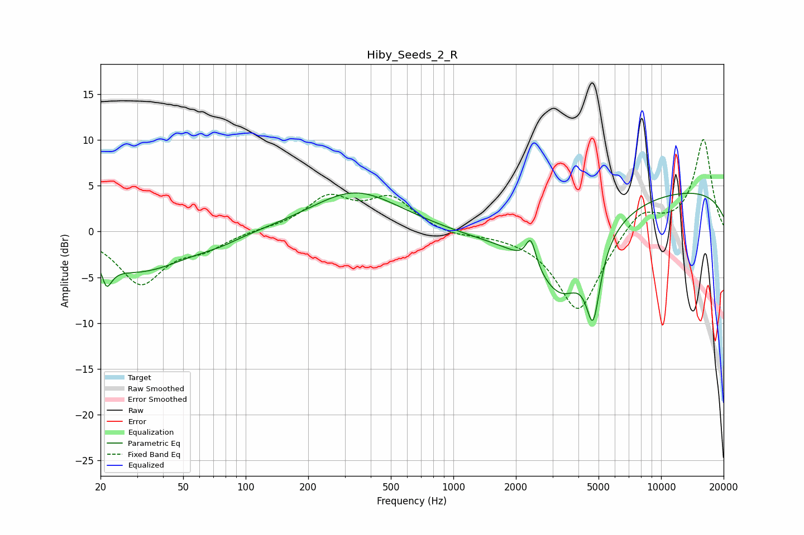

# Hiby_Seeds_2_R
See [usage instructions](https://github.com/jaakkopasanen/AutoEq#usage) for more options and info.

### Parametric EQs
Apply preamp of -4.3 dB when using parametric equalizer.

|   # | Type    |   Fc (Hz) |    Q |   Gain (dB) |
|-----|---------|-----------|------|-------------|
|   1 | Peaking |        21 | 5.96 |         3.2 |
|   2 | Peaking |        21 | 5.38 |        -5.2 |
|   3 | Peaking |        30 | 0.6  |        -4.3 |
|   4 | Peaking |        75 | 1.46 |        -0.5 |
|   5 | Peaking |       337 | 0.66 |         4.4 |
|   6 | Peaking |      1407 | 0.72 |        -0.8 |
|   7 | Peaking |      2361 | 5.84 |         3   |
|   8 | Peaking |      3322 | 0.98 |        -9.4 |
|   9 | Peaking |      4710 | 4.15 |        -7.8 |
|  10 | Peaking |     10000 | 0.18 |         4.7 |

### Fixed Band EQs
When using fixed band (also called graphic) equalizer, apply preamp of **-10.1 dB** (if available) and set gains manually with these parameters.

|   # | Type    |   Fc (Hz) |    Q |   Gain (dB) |
|-----|---------|-----------|------|-------------|
|   1 | Peaking |        31 | 1.41 |        -5.6 |
|   2 | Peaking |        62 | 1.41 |        -1.6 |
|   3 | Peaking |       125 | 1.41 |         0.2 |
|   4 | Peaking |       250 | 1.41 |         3.5 |
|   5 | Peaking |       500 | 1.41 |         3.4 |
|   6 | Peaking |      1000 | 1.41 |        -0.5 |
|   7 | Peaking |      2000 | 1.41 |        -0.2 |
|   8 | Peaking |      4000 | 1.41 |        -8.9 |
|   9 | Peaking |      8000 | 1.41 |         2.7 |
|  10 | Peaking |     16000 | 1.41 |        10.1 |

### Graphs

