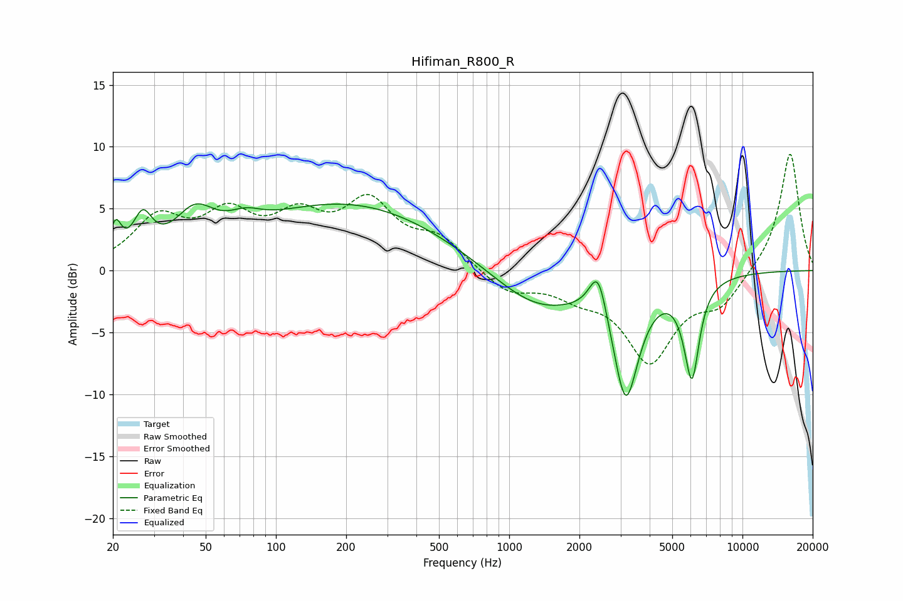

# Hifiman_R800_R
See [usage instructions](https://github.com/jaakkopasanen/AutoEq#usage) for more options and info.

### Parametric EQs
Apply preamp of -5.5 dB when using parametric equalizer.

|   # | Type    |   Fc (Hz) |    Q |   Gain (dB) |
|-----|---------|-----------|------|-------------|
|   1 | Peaking |        21 | 5.94 |         2.6 |
|   2 | Peaking |        27 | 3.51 |         3.1 |
|   3 | Peaking |        45 | 1.67 |         3.2 |
|   4 | Peaking |        74 | 2.07 |         1   |
|   5 | Peaking |       205 | 0.33 |         5.4 |
|   6 | Peaking |      1326 | 0.71 |        -3.4 |
|   7 | Peaking |      2408 | 3.73 |         3.8 |
|   8 | Peaking |      3160 | 2.53 |        -9.7 |
|   9 | Peaking |      5729 | 2.98 |        -1   |
|  10 | Peaking |      6082 | 4.49 |        -7   |

### Fixed Band EQs
When using fixed band (also called graphic) equalizer, apply preamp of **-9.5 dB** (if available) and set gains manually with these parameters.

|   # | Type    |   Fc (Hz) |    Q |   Gain (dB) |
|-----|---------|-----------|------|-------------|
|   1 | Peaking |        31 | 1.41 |         3.9 |
|   2 | Peaking |        62 | 1.41 |         3.9 |
|   3 | Peaking |       125 | 1.41 |         3.6 |
|   4 | Peaking |       250 | 1.41 |         5   |
|   5 | Peaking |       500 | 1.41 |         2.3 |
|   6 | Peaking |      1000 | 1.41 |        -1.8 |
|   7 | Peaking |      2000 | 1.41 |        -1.5 |
|   8 | Peaking |      4000 | 1.41 |        -7   |
|   9 | Peaking |      8000 | 1.41 |        -2.5 |
|  10 | Peaking |     16000 | 1.41 |         9.7 |

### Graphs

