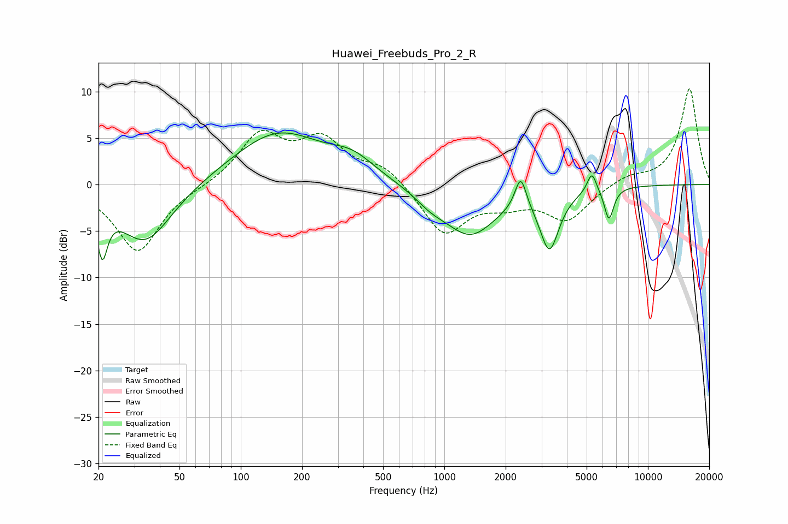

# Huawei_Freebuds_Pro_2_R
See [usage instructions](https://github.com/jaakkopasanen/AutoEq#usage) for more options and info.

### Parametric EQs
Apply preamp of -5.6 dB when using parametric equalizer.

|   # | Type    |   Fc (Hz) |    Q |   Gain (dB) |
|-----|---------|-----------|------|-------------|
|   1 | Peaking |        21 | 5.66 |        -5.4 |
|   2 | Peaking |        34 | 1.06 |        -6.4 |
|   3 | Peaking |       152 | 0.63 |         5.6 |
|   4 | Peaking |       354 | 1.3  |         1.9 |
|   5 | Peaking |       855 | 1.83 |        -1   |
|   6 | Peaking |      1340 | 1.08 |        -5.3 |
|   7 | Peaking |      2372 | 5.11 |         3.5 |
|   8 | Peaking |      3284 | 2.99 |        -6.3 |
|   9 | Peaking |      5305 | 5.98 |         2.2 |
|  10 | Peaking |      6438 | 6    |        -3.5 |

### Fixed Band EQs
When using fixed band (also called graphic) equalizer, apply preamp of **-10.4 dB** (if available) and set gains manually with these parameters.

|   # | Type    |   Fc (Hz) |    Q |   Gain (dB) |
|-----|---------|-----------|------|-------------|
|   1 | Peaking |        31 | 1.41 |        -7.3 |
|   2 | Peaking |        62 | 1.41 |        -0.2 |
|   3 | Peaking |       125 | 1.41 |         5.2 |
|   4 | Peaking |       250 | 1.41 |         4.4 |
|   5 | Peaking |       500 | 1.41 |         1.9 |
|   6 | Peaking |      1000 | 1.41 |        -5.3 |
|   7 | Peaking |      2000 | 1.41 |        -1.6 |
|   8 | Peaking |      4000 | 1.41 |        -3.7 |
|   9 | Peaking |      8000 | 1.41 |         0.9 |
|  10 | Peaking |     16000 | 1.41 |        10.4 |

### Graphs

