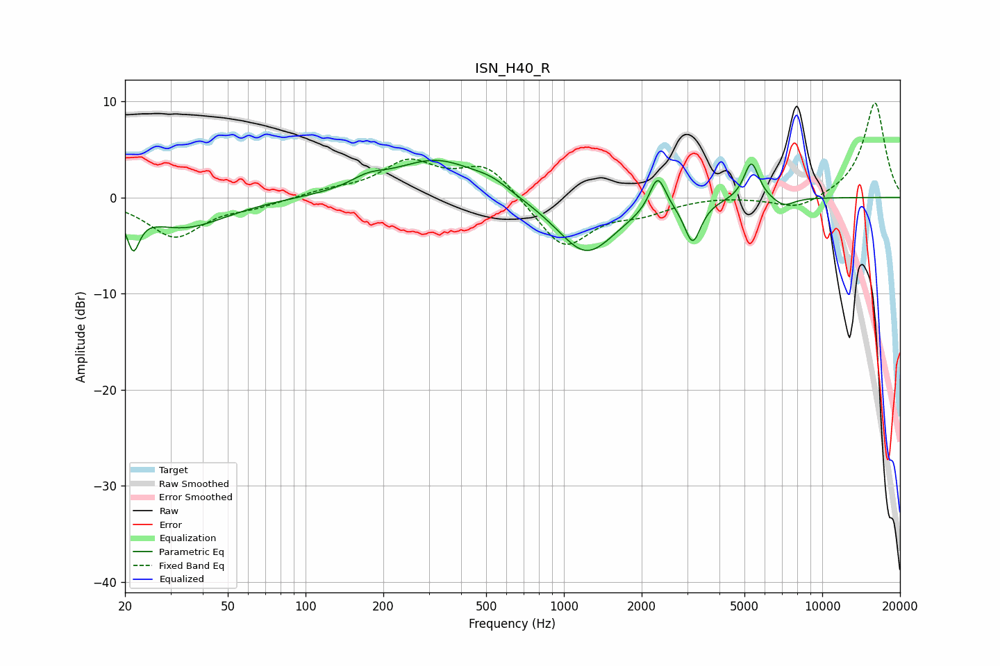

# ISN_H40_R
See [usage instructions](https://github.com/jaakkopasanen/AutoEq#usage) for more options and info.

### Parametric EQs
Apply preamp of -4.0 dB when using parametric equalizer.

|   # | Type    |   Fc (Hz) |    Q |   Gain (dB) |
|-----|---------|-----------|------|-------------|
|   1 | Peaking |        22 | 6    |        -3.8 |
|   2 | Peaking |        34 | 0.87 |        -3.1 |
|   3 | Peaking |       174 | 2.13 |         1   |
|   4 | Peaking |       321 | 0.83 |         4   |
|   5 | Peaking |       526 | 2.02 |         0.8 |
|   6 | Peaking |      1220 | 1.22 |        -6   |
|   7 | Peaking |      2306 | 4.64 |         3.7 |
|   8 | Peaking |      3150 | 4.46 |        -4.3 |
|   9 | Peaking |      5318 | 4.81 |         4   |
|  10 | Peaking |      7090 | 3.25 |        -0.9 |

### Fixed Band EQs
When using fixed band (also called graphic) equalizer, apply preamp of **-9.9 dB** (if available) and set gains manually with these parameters.

|   # | Type    |   Fc (Hz) |    Q |   Gain (dB) |
|-----|---------|-----------|------|-------------|
|   1 | Peaking |        31 | 1.41 |        -4   |
|   2 | Peaking |        62 | 1.41 |        -0.8 |
|   3 | Peaking |       125 | 1.41 |         0.6 |
|   4 | Peaking |       250 | 1.41 |         3.5 |
|   5 | Peaking |       500 | 1.41 |         3.4 |
|   6 | Peaking |      1000 | 1.41 |        -5.4 |
|   7 | Peaking |      2000 | 1.41 |        -1.3 |
|   8 | Peaking |      4000 | 1.41 |         0.2 |
|   9 | Peaking |      8000 | 1.41 |        -1.3 |
|  10 | Peaking |     16000 | 1.41 |         9.9 |

### Graphs

