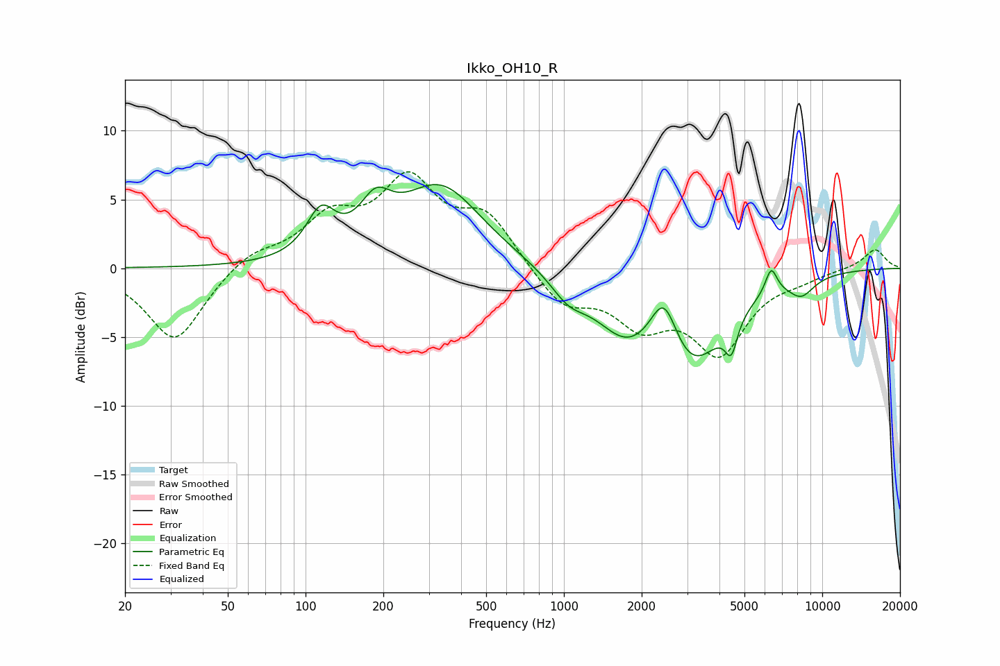

# Ikko_OH10_R
See [usage instructions](https://github.com/jaakkopasanen/AutoEq#usage) for more options and info.

### Parametric EQs
Apply preamp of -6.2 dB when using parametric equalizer.

|   # | Type    |   Fc (Hz) |    Q |   Gain (dB) |
|-----|---------|-----------|------|-------------|
|   1 | Peaking |       115 | 2.55 |         3.2 |
|   2 | Peaking |       186 | 2.33 |         2.8 |
|   3 | Peaking |       333 | 0.89 |         5.9 |
|   4 | Peaking |      1041 | 2    |        -1.6 |
|   5 | Peaking |      1719 | 1.19 |        -3.6 |
|   6 | Peaking |      2440 | 2.71 |         4   |
|   7 | Peaking |      3125 | 1.08 |        -6.4 |
|   8 | Peaking |      4445 | 5.9  |        -2.4 |
|   9 | Peaking |      6344 | 6    |         1.9 |
|  10 | Peaking |      8300 | 2.59 |        -1.3 |

### Fixed Band EQs
When using fixed band (also called graphic) equalizer, apply preamp of **-7.1 dB** (if available) and set gains manually with these parameters.

|   # | Type    |   Fc (Hz) |    Q |   Gain (dB) |
|-----|---------|-----------|------|-------------|
|   1 | Peaking |        31 | 1.41 |        -5.4 |
|   2 | Peaking |        62 | 1.41 |         1.2 |
|   3 | Peaking |       125 | 1.41 |         3.2 |
|   4 | Peaking |       250 | 1.41 |         5.9 |
|   5 | Peaking |       500 | 1.41 |         3.6 |
|   6 | Peaking |      1000 | 1.41 |        -2.7 |
|   7 | Peaking |      2000 | 1.41 |        -3.5 |
|   8 | Peaking |      4000 | 1.41 |        -5.8 |
|   9 | Peaking |      8000 | 1.41 |        -0.5 |
|  10 | Peaking |     16000 | 1.41 |         1.4 |

### Graphs

