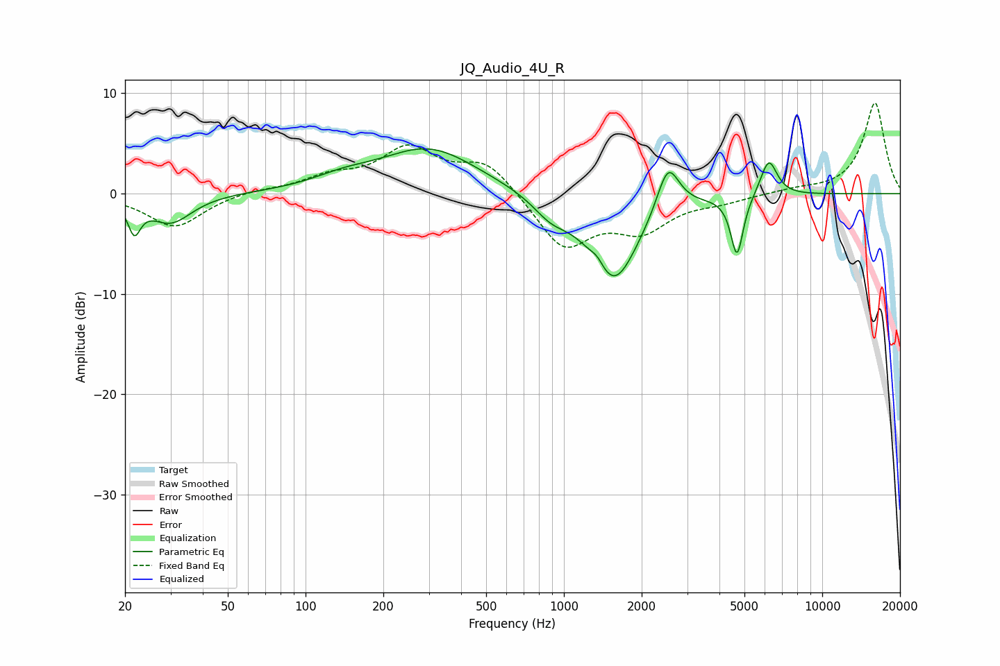

# JQ_Audio_4U_R
See [usage instructions](https://github.com/jaakkopasanen/AutoEq#usage) for more options and info.

### Parametric EQs
Apply preamp of -4.6 dB when using parametric equalizer.

|   # | Type    |   Fc (Hz) |    Q |   Gain (dB) |
|-----|---------|-----------|------|-------------|
|   1 | Peaking |        22 | 5.95 |        -3   |
|   2 | Peaking |        30 | 1.73 |        -2.9 |
|   3 | Peaking |       139 | 1.22 |         0.9 |
|   4 | Peaking |       301 | 0.74 |         4.5 |
|   5 | Peaking |       889 | 2.09 |        -1.6 |
|   6 | Peaking |      1348 | 5.66 |         0.8 |
|   7 | Peaking |      1562 | 1.43 |        -8.9 |
|   8 | Peaking |      2528 | 3.21 |         5   |
|   9 | Peaking |      4678 | 5.79 |        -6   |
|  10 | Peaking |      6208 | 4.21 |         3.7 |

### Fixed Band EQs
When using fixed band (also called graphic) equalizer, apply preamp of **-9.1 dB** (if available) and set gains manually with these parameters.

|   # | Type    |   Fc (Hz) |    Q |   Gain (dB) |
|-----|---------|-----------|------|-------------|
|   1 | Peaking |        31 | 1.41 |        -3.4 |
|   2 | Peaking |        62 | 1.41 |         0.4 |
|   3 | Peaking |       125 | 1.41 |         1.4 |
|   4 | Peaking |       250 | 1.41 |         4.2 |
|   5 | Peaking |       500 | 1.41 |         3.1 |
|   6 | Peaking |      1000 | 1.41 |        -5.4 |
|   7 | Peaking |      2000 | 1.41 |        -3.3 |
|   8 | Peaking |      4000 | 1.41 |        -0.6 |
|   9 | Peaking |      8000 | 1.41 |         0.4 |
|  10 | Peaking |     16000 | 1.41 |         9.1 |

### Graphs

