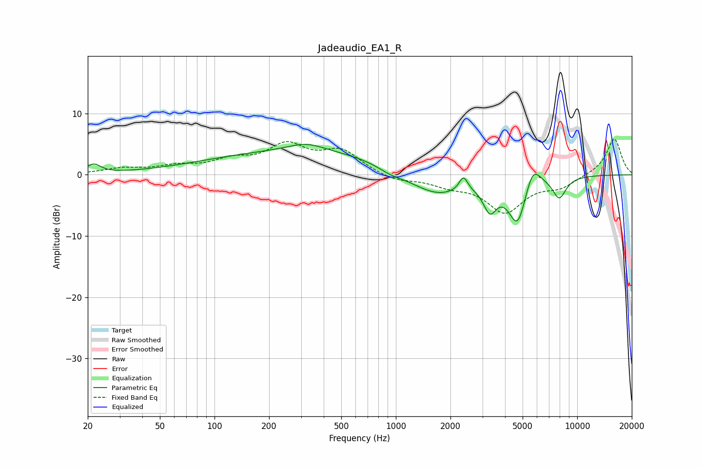

# Jadeaudio_EA1_R
See [usage instructions](https://github.com/jaakkopasanen/AutoEq#usage) for more options and info.

### Parametric EQs
Apply preamp of -5.0 dB when using parametric equalizer.

|   # | Type    |   Fc (Hz) |    Q |   Gain (dB) |
|-----|---------|-----------|------|-------------|
|   1 | Peaking |        22 | 3.76 |         1.5 |
|   2 | Peaking |       320 | 1.36 |         1.4 |
|   3 | Peaking |       334 | 0.23 |         3.9 |
|   4 | Peaking |       939 | 1.86 |        -0.9 |
|   5 | Peaking |      1660 | 0.87 |        -4.3 |
|   6 | Peaking |      2360 | 5.98 |         2.4 |
|   7 | Peaking |      3304 | 3.86 |        -4.2 |
|   8 | Peaking |      4696 | 2.72 |        -7.9 |
|   9 | Peaking |      5668 | 3.15 |         4   |
|  10 | Peaking |      7963 | 3.54 |        -3.5 |

### Fixed Band EQs
When using fixed band (also called graphic) equalizer, apply preamp of **-5.9 dB** (if available) and set gains manually with these parameters.

|   # | Type    |   Fc (Hz) |    Q |   Gain (dB) |
|-----|---------|-----------|------|-------------|
|   1 | Peaking |        31 | 1.41 |         0.9 |
|   2 | Peaking |        62 | 1.41 |         1.2 |
|   3 | Peaking |       125 | 1.41 |         2   |
|   4 | Peaking |       250 | 1.41 |         4.4 |
|   5 | Peaking |       500 | 1.41 |         3.6 |
|   6 | Peaking |      1000 | 1.41 |        -1.1 |
|   7 | Peaking |      2000 | 1.41 |        -1.4 |
|   8 | Peaking |      4000 | 1.41 |        -5.9 |
|   9 | Peaking |      8000 | 1.41 |        -1.8 |
|  10 | Peaking |     16000 | 1.41 |         6   |

### Graphs

