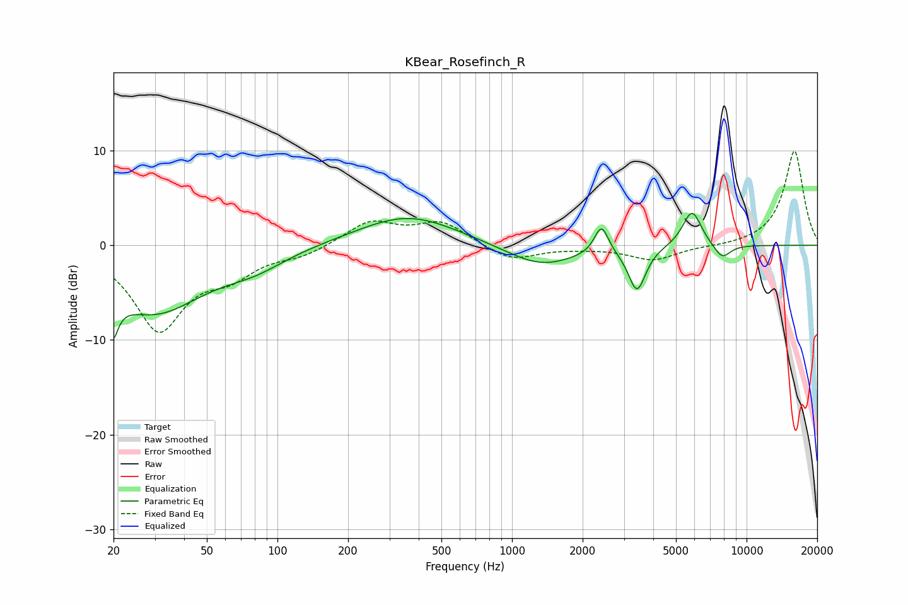

# KBear_Rosefinch_R
See [usage instructions](https://github.com/jaakkopasanen/AutoEq#usage) for more options and info.

### Parametric EQs
Apply preamp of -3.5 dB when using parametric equalizer.

|   # | Type    |   Fc (Hz) |    Q |   Gain (dB) |
|-----|---------|-----------|------|-------------|
|   1 | Peaking |        20 | 5.73 |        -7.6 |
|   2 | Peaking |        20 | 5.89 |         3.3 |
|   3 | Peaking |        30 | 0.65 |        -6.9 |
|   4 | Peaking |        80 | 1.08 |        -1.4 |
|   5 | Peaking |       359 | 0.67 |         3.2 |
|   6 | Peaking |      1328 | 0.95 |        -2.3 |
|   7 | Peaking |      2406 | 4.79 |         3   |
|   8 | Peaking |      3411 | 3.82 |        -4.7 |
|   9 | Peaking |      5851 | 3.39 |         3.9 |
|  10 | Peaking |      7861 | 3.64 |        -1.5 |

### Fixed Band EQs
When using fixed band (also called graphic) equalizer, apply preamp of **-10.0 dB** (if available) and set gains manually with these parameters.

|   # | Type    |   Fc (Hz) |    Q |   Gain (dB) |
|-----|---------|-----------|------|-------------|
|   1 | Peaking |        31 | 1.41 |        -8.7 |
|   2 | Peaking |        62 | 1.41 |        -2.5 |
|   3 | Peaking |       125 | 1.41 |        -0.9 |
|   4 | Peaking |       250 | 1.41 |         2.5 |
|   5 | Peaking |       500 | 1.41 |         2.4 |
|   6 | Peaking |      1000 | 1.41 |        -1.7 |
|   7 | Peaking |      2000 | 1.41 |        -0.2 |
|   8 | Peaking |      4000 | 1.41 |        -1.5 |
|   9 | Peaking |      8000 | 1.41 |        -0.1 |
|  10 | Peaking |     16000 | 1.41 |        10   |

### Graphs

