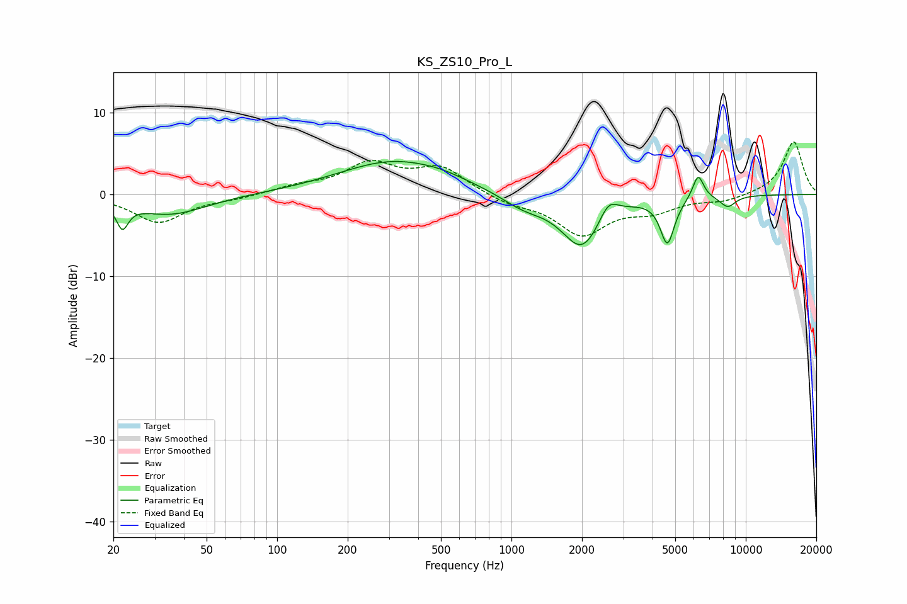

# KS_ZS10_Pro_L
See [usage instructions](https://github.com/jaakkopasanen/AutoEq#usage) for more options and info.

### Parametric EQs
Apply preamp of -4.1 dB when using parametric equalizer.

|   # | Type    |   Fc (Hz) |    Q |   Gain (dB) |
|-----|---------|-----------|------|-------------|
|   1 | Peaking |        22 | 5.76 |        -3   |
|   2 | Peaking |        35 | 0.9  |        -2.5 |
|   3 | Peaking |       314 | 0.6  |         4   |
|   4 | Peaking |       508 | 1.35 |         0.5 |
|   5 | Peaking |      1125 | 1.46 |        -1.6 |
|   6 | Peaking |      2002 | 1.61 |        -6.5 |
|   7 | Peaking |      2592 | 3.43 |         2.4 |
|   8 | Peaking |      4628 | 4.65 |        -5.6 |
|   9 | Peaking |      6264 | 5.84 |         3   |
|  10 | Peaking |      8377 | 3.86 |        -1.4 |

### Fixed Band EQs
When using fixed band (also called graphic) equalizer, apply preamp of **-6.5 dB** (if available) and set gains manually with these parameters.

|   # | Type    |   Fc (Hz) |    Q |   Gain (dB) |
|-----|---------|-----------|------|-------------|
|   1 | Peaking |        31 | 1.41 |        -3.4 |
|   2 | Peaking |        62 | 1.41 |        -0.4 |
|   3 | Peaking |       125 | 1.41 |         0.9 |
|   4 | Peaking |       250 | 1.41 |         3.6 |
|   5 | Peaking |       500 | 1.41 |         3.1 |
|   6 | Peaking |      1000 | 1.41 |        -1   |
|   7 | Peaking |      2000 | 1.41 |        -4.7 |
|   8 | Peaking |      4000 | 1.41 |        -1.7 |
|   9 | Peaking |      8000 | 1.41 |        -0.8 |
|  10 | Peaking |     16000 | 1.41 |         6.5 |

### Graphs

