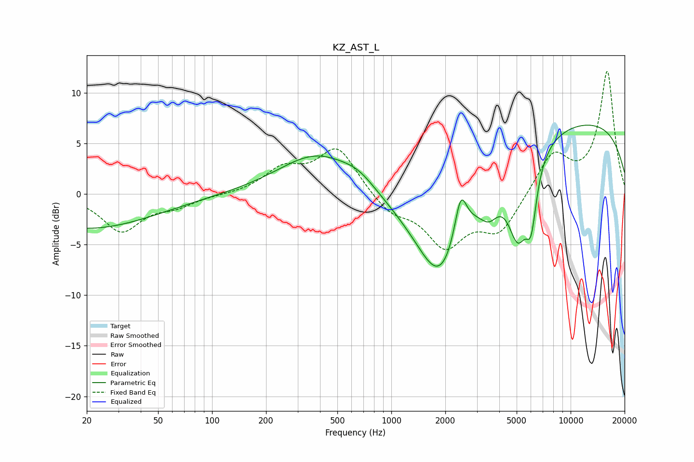

# KZ_AST_L
See [usage instructions](https://github.com/jaakkopasanen/AutoEq#usage) for more options and info.

### Parametric EQs
Apply preamp of -6.9 dB when using parametric equalizer.

|   # | Type    |   Fc (Hz) |    Q |   Gain (dB) |
|-----|---------|-----------|------|-------------|
|   1 | Peaking |        20 | 0.37 |        -3.4 |
|   2 | Peaking |       385 | 0.66 |         4   |
|   3 | Peaking |       657 | 1.48 |         1.1 |
|   4 | Peaking |      1884 | 0.93 |       -10.6 |
|   5 | Peaking |      2437 | 4.12 |         4.6 |
|   6 | Peaking |      3510 | 2.57 |        -2.4 |
|   7 | Peaking |      5085 | 2.31 |        -7.8 |
|   8 | Peaking |      6025 | 4.53 |        -5.1 |
|   9 | Peaking |      9852 | 0.21 |         3.4 |
|  10 | Peaking |     10000 | 0.2  |         4.1 |

### Fixed Band EQs
When using fixed band (also called graphic) equalizer, apply preamp of **-12.2 dB** (if available) and set gains manually with these parameters.

|   # | Type    |   Fc (Hz) |    Q |   Gain (dB) |
|-----|---------|-----------|------|-------------|
|   1 | Peaking |        31 | 1.41 |        -3.6 |
|   2 | Peaking |        62 | 1.41 |        -1   |
|   3 | Peaking |       125 | 1.41 |        -0.1 |
|   4 | Peaking |       250 | 1.41 |         2.3 |
|   5 | Peaking |       500 | 1.41 |         4.5 |
|   6 | Peaking |      1000 | 1.41 |        -1.8 |
|   7 | Peaking |      2000 | 1.41 |        -4.8 |
|   8 | Peaking |      4000 | 1.41 |        -3.6 |
|   9 | Peaking |      8000 | 1.41 |         4   |
|  10 | Peaking |     16000 | 1.41 |        12.1 |

### Graphs

