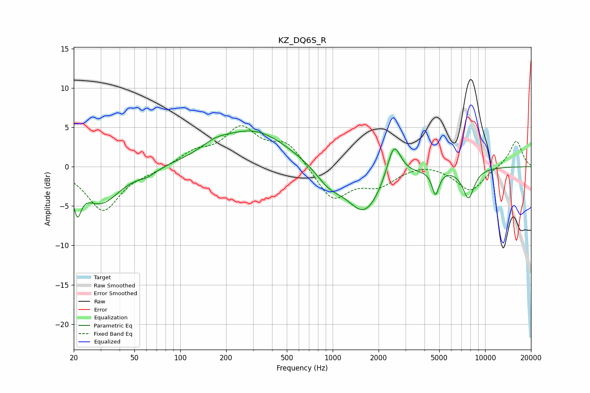

# KZ_DQ6S_R
See [usage instructions](https://github.com/jaakkopasanen/AutoEq#usage) for more options and info.

### Parametric EQs
Apply preamp of -4.6 dB when using parametric equalizer.

|   # | Type    |   Fc (Hz) |    Q |   Gain (dB) |
|-----|---------|-----------|------|-------------|
|   1 | Peaking |        21 | 5.59 |        -3.7 |
|   2 | Peaking |        30 | 1.12 |        -4.6 |
|   3 | Peaking |        61 | 2.45 |        -0.7 |
|   4 | Peaking |       168 | 1.59 |         1   |
|   5 | Peaking |       303 | 0.61 |         4.6 |
|   6 | Peaking |       942 | 1.6  |        -1.9 |
|   7 | Peaking |      1617 | 1.2  |        -5.9 |
|   8 | Peaking |      2518 | 3.04 |         4.9 |
|   9 | Peaking |      4727 | 6    |        -3   |
|  10 | Peaking |      7773 | 3.38 |        -3.8 |

### Fixed Band EQs
When using fixed band (also called graphic) equalizer, apply preamp of **-5.3 dB** (if available) and set gains manually with these parameters.

|   # | Type    |   Fc (Hz) |    Q |   Gain (dB) |
|-----|---------|-----------|------|-------------|
|   1 | Peaking |        31 | 1.41 |        -5.6 |
|   2 | Peaking |        62 | 1.41 |        -0.5 |
|   3 | Peaking |       125 | 1.41 |         1.7 |
|   4 | Peaking |       250 | 1.41 |         4.6 |
|   5 | Peaking |       500 | 1.41 |         2.9 |
|   6 | Peaking |      1000 | 1.41 |        -4.3 |
|   7 | Peaking |      2000 | 1.41 |        -2.1 |
|   8 | Peaking |      4000 | 1.41 |         0.6 |
|   9 | Peaking |      8000 | 1.41 |        -3.1 |
|  10 | Peaking |     16000 | 1.41 |         3.4 |

### Graphs

