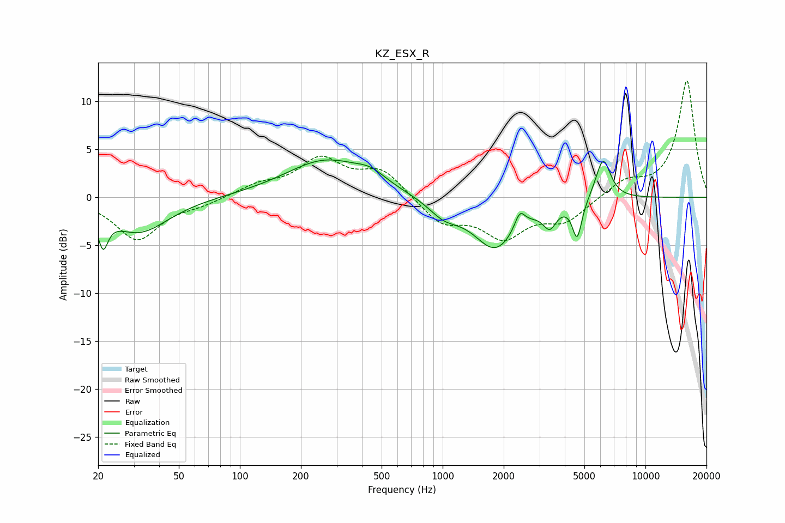

# KZ_ESX_R
See [usage instructions](https://github.com/jaakkopasanen/AutoEq#usage) for more options and info.

### Parametric EQs
Apply preamp of -4.0 dB when using parametric equalizer.

|   # | Type    |   Fc (Hz) |    Q |   Gain (dB) |
|-----|---------|-----------|------|-------------|
|   1 | Peaking |        21 | 5.82 |        -3.3 |
|   2 | Peaking |        32 | 0.99 |        -3.7 |
|   3 | Peaking |       265 | 0.71 |         3.9 |
|   4 | Peaking |       443 | 1.94 |         1   |
|   5 | Peaking |      1014 | 1.84 |        -1.6 |
|   6 | Peaking |      1818 | 1.3  |        -5.3 |
|   7 | Peaking |      2401 | 5.51 |         1.8 |
|   8 | Peaking |      3375 | 4.33 |        -2.1 |
|   9 | Peaking |      4605 | 5.89 |        -4   |
|  10 | Peaking |      6182 | 3.74 |         4.3 |

### Fixed Band EQs
When using fixed band (also called graphic) equalizer, apply preamp of **-12.2 dB** (if available) and set gains manually with these parameters.

|   # | Type    |   Fc (Hz) |    Q |   Gain (dB) |
|-----|---------|-----------|------|-------------|
|   1 | Peaking |        31 | 1.41 |        -4.4 |
|   2 | Peaking |        62 | 1.41 |        -0.6 |
|   3 | Peaking |       125 | 1.41 |         1.1 |
|   4 | Peaking |       250 | 1.41 |         3.8 |
|   5 | Peaking |       500 | 1.41 |         2.7 |
|   6 | Peaking |      1000 | 1.41 |        -2.6 |
|   7 | Peaking |      2000 | 1.41 |        -3.8 |
|   8 | Peaking |      4000 | 1.41 |        -2.3 |
|   9 | Peaking |      8000 | 1.41 |         1.6 |
|  10 | Peaking |     16000 | 1.41 |        12.2 |

### Graphs

