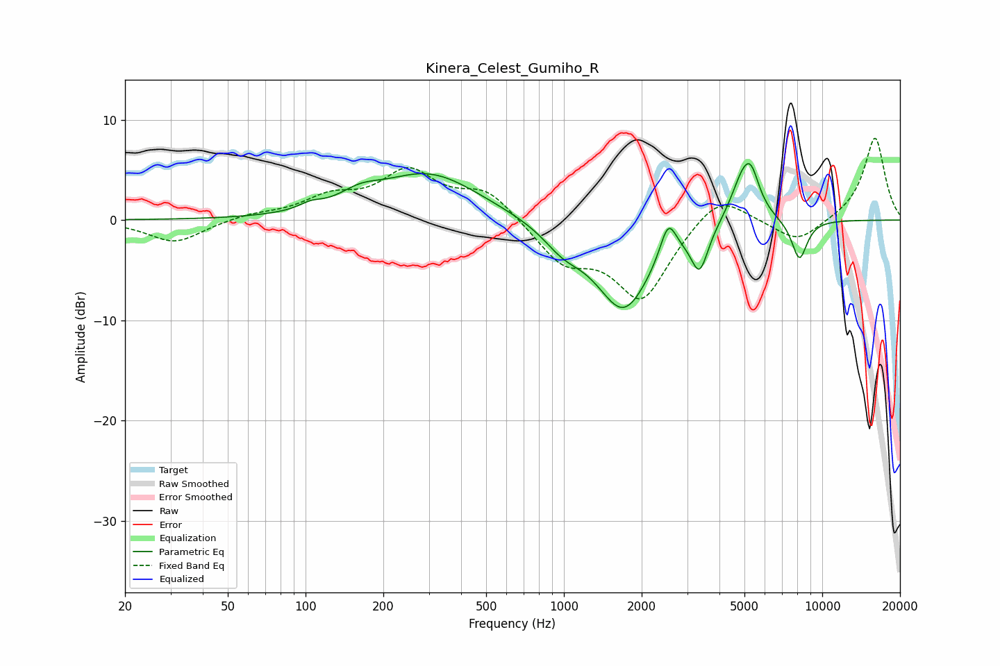

# Kinera_Celest_Gumiho_R
See [usage instructions](https://github.com/jaakkopasanen/AutoEq#usage) for more options and info.

### Parametric EQs
Apply preamp of -5.7 dB when using parametric equalizer.

|   # | Type    |   Fc (Hz) |    Q |   Gain (dB) |
|-----|---------|-----------|------|-------------|
|   1 | Peaking |       104 | 3.48 |         0.6 |
|   2 | Peaking |       162 | 1.84 |         1.2 |
|   3 | Peaking |       300 | 0.71 |         4.7 |
|   4 | Peaking |       990 | 1.89 |        -1.8 |
|   5 | Peaking |      1702 | 1.27 |        -8.9 |
|   6 | Peaking |      2533 | 4.46 |         3.6 |
|   7 | Peaking |      3353 | 4.31 |        -4.1 |
|   8 | Peaking |      4987 | 2.72 |         5.1 |
|   9 | Peaking |      5328 | 4.88 |         2   |
|  10 | Peaking |      8159 | 4.28 |        -4   |

### Fixed Band EQs
When using fixed band (also called graphic) equalizer, apply preamp of **-8.3 dB** (if available) and set gains manually with these parameters.

|   # | Type    |   Fc (Hz) |    Q |   Gain (dB) |
|-----|---------|-----------|------|-------------|
|   1 | Peaking |        31 | 1.41 |        -2.3 |
|   2 | Peaking |        62 | 1.41 |         0.5 |
|   3 | Peaking |       125 | 1.41 |         2   |
|   4 | Peaking |       250 | 1.41 |         4.5 |
|   5 | Peaking |       500 | 1.41 |         2.9 |
|   6 | Peaking |      1000 | 1.41 |        -3.9 |
|   7 | Peaking |      2000 | 1.41 |        -7.7 |
|   8 | Peaking |      4000 | 1.41 |         3.1 |
|   9 | Peaking |      8000 | 1.41 |        -2.3 |
|  10 | Peaking |     16000 | 1.41 |         8.3 |

### Graphs

