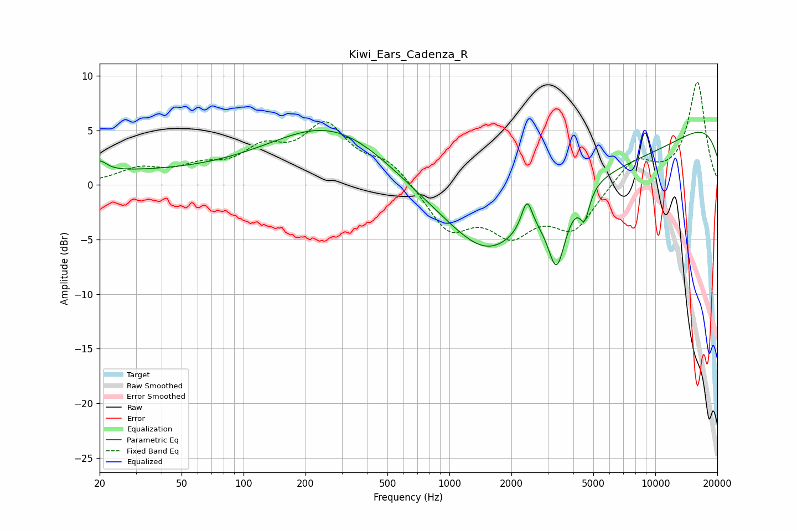

# Kiwi_Ears_Cadenza_R
See [usage instructions](https://github.com/jaakkopasanen/AutoEq#usage) for more options and info.

### Parametric EQs
Apply preamp of -5.1 dB when using parametric equalizer.

|   # | Type    |   Fc (Hz) |    Q |   Gain (dB) |
|-----|---------|-----------|------|-------------|
|   1 | Peaking |        20 | 4.31 |         0.9 |
|   2 | Peaking |        21 | 0.18 |         1.1 |
|   3 | Peaking |       271 | 0.47 |         5.5 |
|   4 | Peaking |      1552 | 0.84 |        -3.9 |
|   5 | Peaking |      2379 | 5.39 |         2.8 |
|   6 | Peaking |      3317 | 3.31 |        -5.9 |
|   7 | Peaking |      3700 | 2.68 |        -0.1 |
|   8 | Peaking |      4101 | 0.18 |        -6.4 |
|   9 | Peaking |      4537 | 6    |        -2.5 |
|  10 | Peaking |     10000 | 0.18 |         8.5 |

### Fixed Band EQs
When using fixed band (also called graphic) equalizer, apply preamp of **-9.5 dB** (if available) and set gains manually with these parameters.

|   # | Type    |   Fc (Hz) |    Q |   Gain (dB) |
|-----|---------|-----------|------|-------------|
|   1 | Peaking |        31 | 1.41 |         1.3 |
|   2 | Peaking |        62 | 1.41 |         1.3 |
|   3 | Peaking |       125 | 1.41 |         2.7 |
|   4 | Peaking |       250 | 1.41 |         5.1 |
|   5 | Peaking |       500 | 1.41 |         2   |
|   6 | Peaking |      1000 | 1.41 |        -4   |
|   7 | Peaking |      2000 | 1.41 |        -3.9 |
|   8 | Peaking |      4000 | 1.41 |        -3.8 |
|   9 | Peaking |      8000 | 1.41 |         2.4 |
|  10 | Peaking |     16000 | 1.41 |         9.4 |

### Graphs

