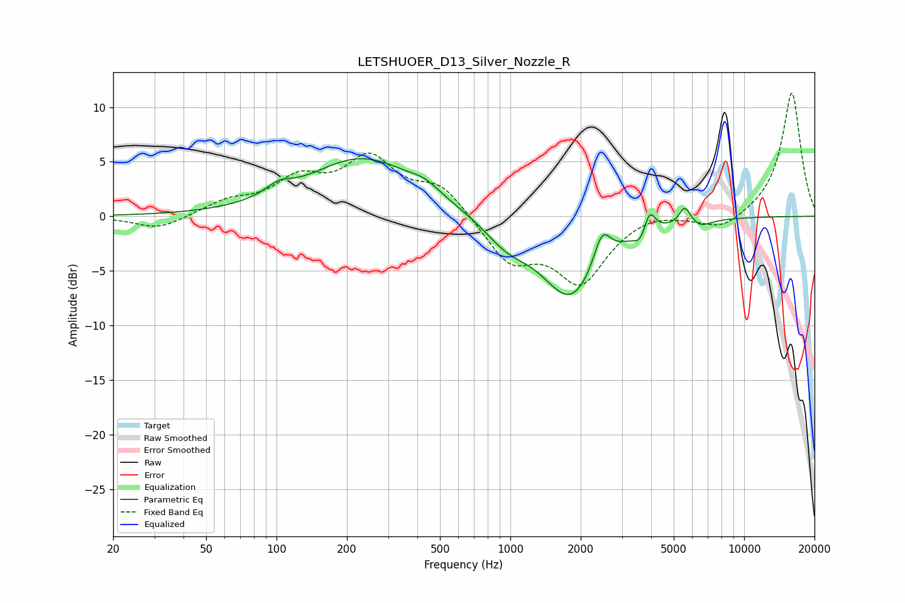

# LETSHUOER_D13_Silver_Nozzle_R
See [usage instructions](https://github.com/jaakkopasanen/AutoEq#usage) for more options and info.

### Parametric EQs
Apply preamp of -5.4 dB when using parametric equalizer.

|   # | Type    |   Fc (Hz) |    Q |   Gain (dB) |
|-----|---------|-----------|------|-------------|
|   1 | Peaking |       102 | 2.58 |         1   |
|   2 | Peaking |       234 | 0.61 |         5.3 |
|   3 | Peaking |       432 | 2.22 |         0.8 |
|   4 | Peaking |       962 | 1.52 |        -1.9 |
|   5 | Peaking |      1822 | 1.09 |        -7.5 |
|   6 | Peaking |      2467 | 3.82 |         3.2 |
|   7 | Peaking |      3593 | 5.55 |        -1   |
|   8 | Peaking |      3944 | 6    |         2   |
|   9 | Peaking |      5579 | 5.98 |         1.6 |
|  10 | Peaking |      6563 | 3.41 |        -0.6 |

### Fixed Band EQs
When using fixed band (also called graphic) equalizer, apply preamp of **-11.4 dB** (if available) and set gains manually with these parameters.

|   # | Type    |   Fc (Hz) |    Q |   Gain (dB) |
|-----|---------|-----------|------|-------------|
|   1 | Peaking |        31 | 1.41 |        -1.2 |
|   2 | Peaking |        62 | 1.41 |         1.2 |
|   3 | Peaking |       125 | 1.41 |         3   |
|   4 | Peaking |       250 | 1.41 |         4.9 |
|   5 | Peaking |       500 | 1.41 |         2.7 |
|   6 | Peaking |      1000 | 1.41 |        -4   |
|   7 | Peaking |      2000 | 1.41 |        -5.8 |
|   8 | Peaking |      4000 | 1.41 |         0.6 |
|   9 | Peaking |      8000 | 1.41 |        -1.3 |
|  10 | Peaking |     16000 | 1.41 |        11.4 |

### Graphs

