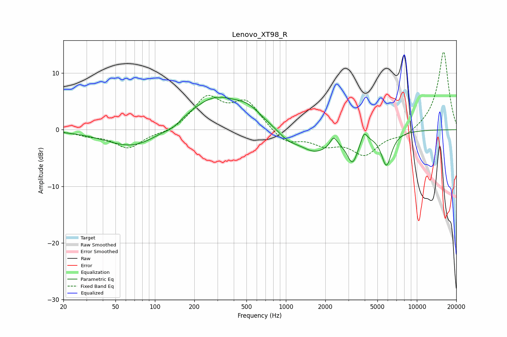

# Lenovo_XT98_R
See [usage instructions](https://github.com/jaakkopasanen/AutoEq#usage) for more options and info.

### Parametric EQs
Apply preamp of -5.8 dB when using parametric equalizer.

|   # | Type    |   Fc (Hz) |    Q |   Gain (dB) |
|-----|---------|-----------|------|-------------|
|   1 | Peaking |        69 | 0.69 |        -3.4 |
|   2 | Peaking |       137 | 2.65 |        -0.7 |
|   3 | Peaking |       288 | 0.67 |         5.9 |
|   4 | Peaking |       518 | 1.5  |         1.7 |
|   5 | Peaking |      1028 | 1.89 |        -1.4 |
|   6 | Peaking |      1672 | 1.09 |        -3.8 |
|   7 | Peaking |      2314 | 5.75 |         1.7 |
|   8 | Peaking |      3226 | 3.33 |        -4.7 |
|   9 | Peaking |      3952 | 6    |         1.9 |
|  10 | Peaking |      5859 | 3.54 |        -5.9 |

### Fixed Band EQs
When using fixed band (also called graphic) equalizer, apply preamp of **-13.8 dB** (if available) and set gains manually with these parameters.

|   # | Type    |   Fc (Hz) |    Q |   Gain (dB) |
|-----|---------|-----------|------|-------------|
|   1 | Peaking |        31 | 1.41 |        -0.8 |
|   2 | Peaking |        62 | 1.41 |        -3.2 |
|   3 | Peaking |       125 | 1.41 |        -0.6 |
|   4 | Peaking |       250 | 1.41 |         5.5 |
|   5 | Peaking |       500 | 1.41 |         4.7 |
|   6 | Peaking |      1000 | 1.41 |        -2.5 |
|   7 | Peaking |      2000 | 1.41 |        -2.2 |
|   8 | Peaking |      4000 | 1.41 |        -4.2 |
|   9 | Peaking |      8000 | 1.41 |        -1.3 |
|  10 | Peaking |     16000 | 1.41 |        13.9 |

### Graphs

