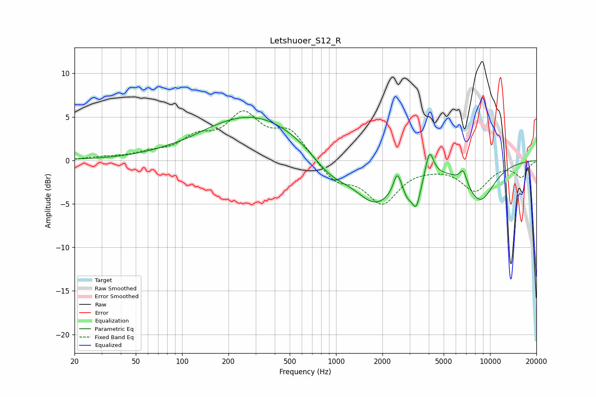

# Letshuoer_S12_R
See [usage instructions](https://github.com/jaakkopasanen/AutoEq#usage) for more options and info.

### Parametric EQs
Apply preamp of -5.0 dB when using parametric equalizer.

|   # | Type    |   Fc (Hz) |    Q |   Gain (dB) |
|-----|---------|-----------|------|-------------|
|   1 | Peaking |       106 | 2.25 |        -0.1 |
|   2 | Peaking |       291 | 0.42 |         5.3 |
|   3 | Peaking |       912 | 1.14 |        -2.3 |
|   4 | Peaking |      1818 | 1.01 |        -4.9 |
|   5 | Peaking |      2496 | 6    |         2.3 |
|   6 | Peaking |      2911 | 5.48 |        -1.2 |
|   7 | Peaking |      3316 | 4.83 |        -3.4 |
|   8 | Peaking |      4048 | 5.57 |         3   |
|   9 | Peaking |      6697 | 6    |         1.6 |
|  10 | Peaking |      8618 | 1.36 |        -4.4 |

### Fixed Band EQs
When using fixed band (also called graphic) equalizer, apply preamp of **-5.8 dB** (if available) and set gains manually with these parameters.

|   # | Type    |   Fc (Hz) |    Q |   Gain (dB) |
|-----|---------|-----------|------|-------------|
|   1 | Peaking |        31 | 1.41 |         0.3 |
|   2 | Peaking |        62 | 1.41 |         0.7 |
|   3 | Peaking |       125 | 1.41 |         2.2 |
|   4 | Peaking |       250 | 1.41 |         4.8 |
|   5 | Peaking |       500 | 1.41 |         3.2 |
|   6 | Peaking |      1000 | 1.41 |        -2.3 |
|   7 | Peaking |      2000 | 1.41 |        -4.6 |
|   8 | Peaking |      4000 | 1.41 |        -0.3 |
|   9 | Peaking |      8000 | 1.41 |        -3.3 |
|  10 | Peaking |     16000 | 1.41 |        -1.8 |

### Graphs

