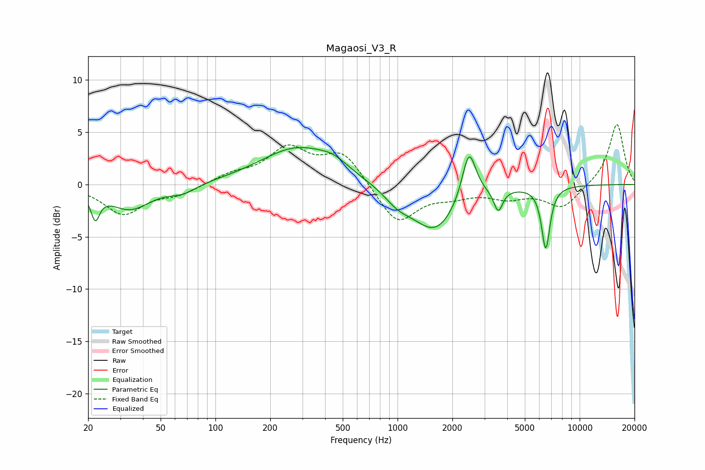

# Magaosi_V3_R
See [usage instructions](https://github.com/jaakkopasanen/AutoEq#usage) for more options and info.

### Parametric EQs
Apply preamp of -3.6 dB when using parametric equalizer.

|   # | Type    |   Fc (Hz) |    Q |   Gain (dB) |
|-----|---------|-----------|------|-------------|
|   1 | Peaking |        22 | 5.98 |        -2.5 |
|   2 | Peaking |        34 | 1.25 |        -2.4 |
|   3 | Peaking |        66 | 1.91 |        -0.8 |
|   4 | Peaking |       283 | 0.69 |         3.5 |
|   5 | Peaking |       445 | 1.86 |         0.8 |
|   6 | Peaking |      1002 | 1.9  |        -1.2 |
|   7 | Peaking |      1607 | 1.13 |        -4.5 |
|   8 | Peaking |      2467 | 3.66 |         4.9 |
|   9 | Peaking |      3572 | 5.96 |        -2.1 |
|  10 | Peaking |      6514 | 5.89 |        -5.9 |

### Fixed Band EQs
When using fixed band (also called graphic) equalizer, apply preamp of **-5.8 dB** (if available) and set gains manually with these parameters.

|   # | Type    |   Fc (Hz) |    Q |   Gain (dB) |
|-----|---------|-----------|------|-------------|
|   1 | Peaking |        31 | 1.41 |        -2.8 |
|   2 | Peaking |        62 | 1.41 |        -0.9 |
|   3 | Peaking |       125 | 1.41 |         0.9 |
|   4 | Peaking |       250 | 1.41 |         3.3 |
|   5 | Peaking |       500 | 1.41 |         3   |
|   6 | Peaking |      1000 | 1.41 |        -3.8 |
|   7 | Peaking |      2000 | 1.41 |        -0.8 |
|   8 | Peaking |      4000 | 1.41 |        -1.1 |
|   9 | Peaking |      8000 | 1.41 |        -2.2 |
|  10 | Peaking |     16000 | 1.41 |         5.9 |

### Graphs

