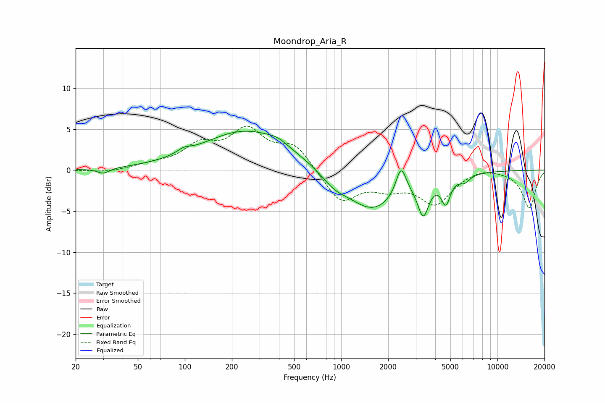

# Moondrop_Aria_R
See [usage instructions](https://github.com/jaakkopasanen/AutoEq#usage) for more options and info.

### Parametric EQs
Apply preamp of -4.8 dB when using parametric equalizer.

|   # | Type    |   Fc (Hz) |    Q |   Gain (dB) |
|-----|---------|-----------|------|-------------|
|   1 | Peaking |        30 | 3.74 |        -0.7 |
|   2 | Peaking |        98 | 3.36 |         0.5 |
|   3 | Peaking |       249 | 0.5  |         4.8 |
|   4 | Peaking |       391 | 2.26 |         0.5 |
|   5 | Peaking |       903 | 1.71 |        -1.3 |
|   6 | Peaking |      1589 | 0.85 |        -4.9 |
|   7 | Peaking |      2417 | 4.31 |         3.5 |
|   8 | Peaking |      3352 | 4    |        -4.2 |
|   9 | Peaking |      4676 | 4.89 |        -3.1 |
|  10 | Peaking |      6163 | 4.06 |        -0.8 |

### Fixed Band EQs
When using fixed band (also called graphic) equalizer, apply preamp of **-5.5 dB** (if available) and set gains manually with these parameters.

|   # | Type    |   Fc (Hz) |    Q |   Gain (dB) |
|-----|---------|-----------|------|-------------|
|   1 | Peaking |        31 | 1.41 |        -0.3 |
|   2 | Peaking |        62 | 1.41 |         0.6 |
|   3 | Peaking |       125 | 1.41 |         2.7 |
|   4 | Peaking |       250 | 1.41 |         4.5 |
|   5 | Peaking |       500 | 1.41 |         2.9 |
|   6 | Peaking |      1000 | 1.41 |        -3.9 |
|   7 | Peaking |      2000 | 1.41 |        -1.7 |
|   8 | Peaking |      4000 | 1.41 |        -3.9 |
|   9 | Peaking |      8000 | 1.41 |         0.5 |
|  10 | Peaking |     16000 | 1.41 |        -4.6 |

### Graphs

