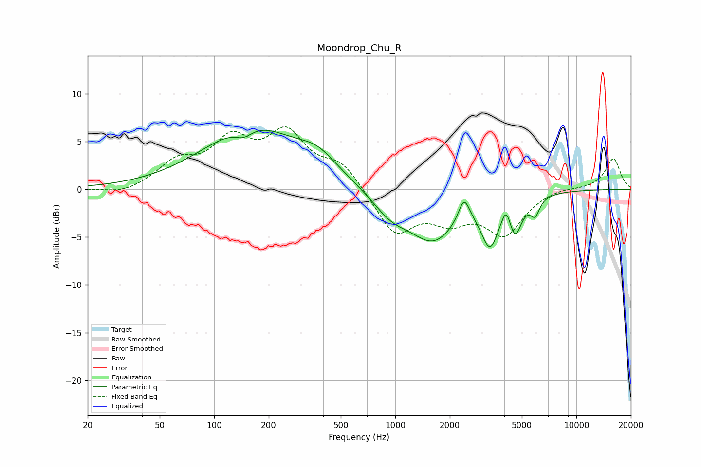

# Moondrop_Chu_R
See [usage instructions](https://github.com/jaakkopasanen/AutoEq#usage) for more options and info.

### Parametric EQs
Apply preamp of -6.3 dB when using parametric equalizer.

|   # | Type    |   Fc (Hz) |    Q |   Gain (dB) |
|-----|---------|-----------|------|-------------|
|   1 | Peaking |       146 | 2.87 |        -1   |
|   2 | Peaking |       161 | 0.53 |         6.4 |
|   3 | Peaking |       373 | 1.32 |         1.8 |
|   4 | Peaking |       946 | 1.36 |        -2.2 |
|   5 | Peaking |      1624 | 1.06 |        -5   |
|   6 | Peaking |      2397 | 4.58 |         2.6 |
|   7 | Peaking |      3335 | 2.97 |        -4.7 |
|   8 | Peaking |      4101 | 6    |         1.8 |
|   9 | Peaking |      4590 | 3.92 |        -3.6 |
|  10 | Peaking |      5911 | 5.41 |        -1.8 |

### Fixed Band EQs
When using fixed band (also called graphic) equalizer, apply preamp of **-6.6 dB** (if available) and set gains manually with these parameters.

|   # | Type    |   Fc (Hz) |    Q |   Gain (dB) |
|-----|---------|-----------|------|-------------|
|   1 | Peaking |        31 | 1.41 |        -0.6 |
|   2 | Peaking |        62 | 1.41 |         2.5 |
|   3 | Peaking |       125 | 1.41 |         4.6 |
|   4 | Peaking |       250 | 1.41 |         5.3 |
|   5 | Peaking |       500 | 1.41 |         2.5 |
|   6 | Peaking |      1000 | 1.41 |        -4.6 |
|   7 | Peaking |      2000 | 1.41 |        -2.7 |
|   8 | Peaking |      4000 | 1.41 |        -4.4 |
|   9 | Peaking |      8000 | 1.41 |         0.3 |
|  10 | Peaking |     16000 | 1.41 |         3.2 |

### Graphs

