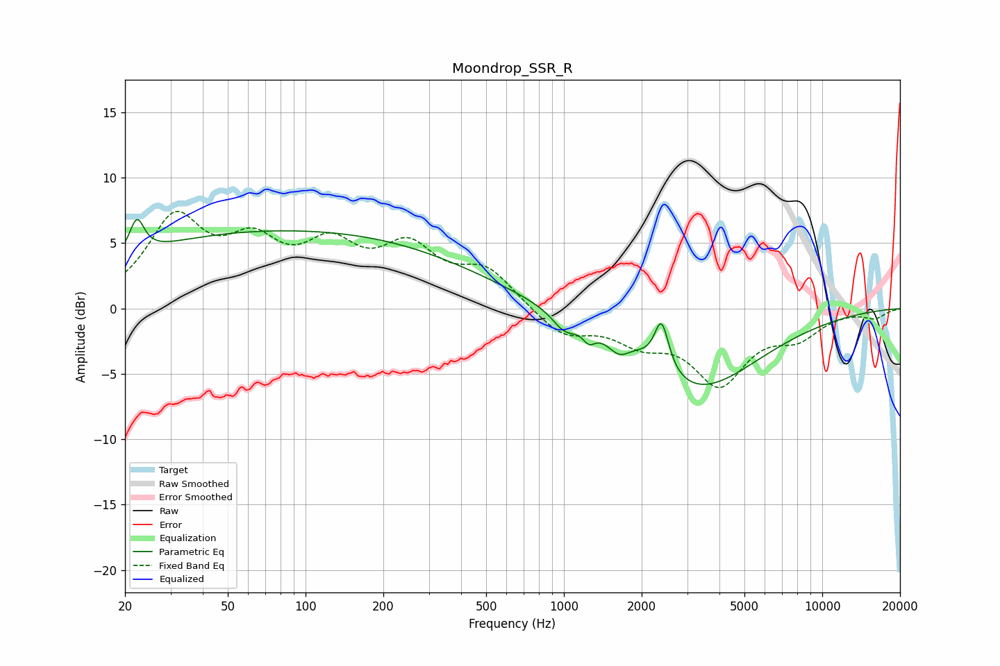

# Moondrop_SSR_R
See [usage instructions](https://github.com/jaakkopasanen/AutoEq#usage) for more options and info.

### Parametric EQs
Apply preamp of -6.9 dB when using parametric equalizer.

|   # | Type    |   Fc (Hz) |    Q |   Gain (dB) |
|-----|---------|-----------|------|-------------|
|   1 | Peaking |        22 | 5.85 |        -0.7 |
|   2 | Peaking |        22 | 5.28 |         3.4 |
|   3 | Peaking |        85 | 0.18 |         5.9 |
|   4 | Peaking |      1004 | 3.1  |        -1.2 |
|   5 | Peaking |      1251 | 5.9  |        -0.9 |
|   6 | Peaking |      1406 | 2.5  |        -0.1 |
|   7 | Peaking |      1637 | 2.8  |        -2.1 |
|   8 | Peaking |      1706 | 1.47 |         2.1 |
|   9 | Peaking |      2388 | 5.05 |         3.8 |
|  10 | Peaking |      3125 | 0.56 |        -6.5 |

### Fixed Band EQs
When using fixed band (also called graphic) equalizer, apply preamp of **-7.5 dB** (if available) and set gains manually with these parameters.

|   # | Type    |   Fc (Hz) |    Q |   Gain (dB) |
|-----|---------|-----------|------|-------------|
|   1 | Peaking |        31 | 1.41 |         6.5 |
|   2 | Peaking |        62 | 1.41 |         4   |
|   3 | Peaking |       125 | 1.41 |         4   |
|   4 | Peaking |       250 | 1.41 |         4.1 |
|   5 | Peaking |       500 | 1.41 |         2.7 |
|   6 | Peaking |      1000 | 1.41 |        -2   |
|   7 | Peaking |      2000 | 1.41 |        -2.1 |
|   8 | Peaking |      4000 | 1.41 |        -5.4 |
|   9 | Peaking |      8000 | 1.41 |        -1.8 |
|  10 | Peaking |     16000 | 1.41 |        -0.7 |

### Graphs

