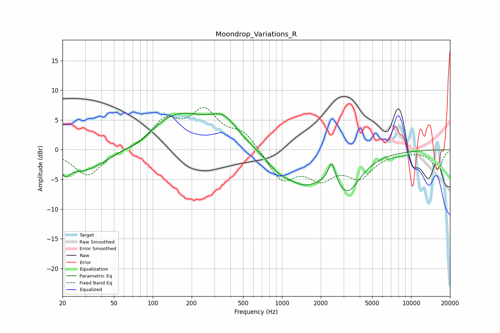

# Moondrop_Variations_R
See [usage instructions](https://github.com/jaakkopasanen/AutoEq#usage) for more options and info.

### Parametric EQs
Apply preamp of -6.2 dB when using parametric equalizer.

|   # | Type    |   Fc (Hz) |    Q |   Gain (dB) |
|-----|---------|-----------|------|-------------|
|   1 | Peaking |        21 | 5.79 |         3.1 |
|   2 | Peaking |        21 | 5.66 |        -4.6 |
|   3 | Peaking |        28 | 0.66 |        -4.1 |
|   4 | Peaking |        81 | 1.29 |        -1.4 |
|   5 | Peaking |       151 | 0.56 |         6.2 |
|   6 | Peaking |       356 | 1.34 |         3.5 |
|   7 | Peaking |       932 | 1.58 |        -1.7 |
|   8 | Peaking |      1479 | 0.92 |        -5   |
|   9 | Peaking |      2431 | 5.13 |         3.7 |
|  10 | Peaking |      3219 | 1.38 |        -5.9 |

### Fixed Band EQs
When using fixed band (also called graphic) equalizer, apply preamp of **-7.2 dB** (if available) and set gains manually with these parameters.

|   # | Type    |   Fc (Hz) |    Q |   Gain (dB) |
|-----|---------|-----------|------|-------------|
|   1 | Peaking |        31 | 1.41 |        -4.5 |
|   2 | Peaking |        62 | 1.41 |        -0.1 |
|   3 | Peaking |       125 | 1.41 |         4.5 |
|   4 | Peaking |       250 | 1.41 |         6   |
|   5 | Peaking |       500 | 1.41 |         2.8 |
|   6 | Peaking |      1000 | 1.41 |        -5   |
|   7 | Peaking |      2000 | 1.41 |        -4.1 |
|   8 | Peaking |      4000 | 1.41 |        -4.1 |
|   9 | Peaking |      8000 | 1.41 |        -0.3 |
|  10 | Peaking |     16000 | 1.41 |        -3.2 |

### Graphs

