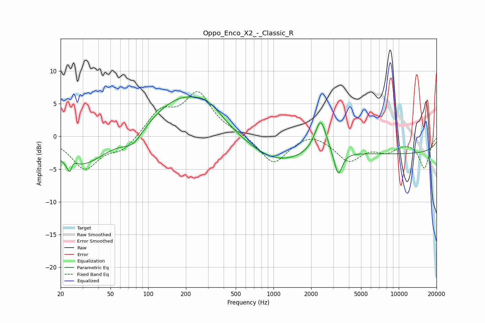

# Oppo_Enco_X2_-_Classic_R
See [usage instructions](https://github.com/jaakkopasanen/AutoEq#usage) for more options and info.

### Parametric EQs
Apply preamp of -6.1 dB when using parametric equalizer.

|   # | Type    |   Fc (Hz) |    Q |   Gain (dB) |
|-----|---------|-----------|------|-------------|
|   1 | Peaking |        24 | 5.91 |        -4.3 |
|   2 | Peaking |        25 | 5.46 |         3.4 |
|   3 | Peaking |        29 | 0.69 |        -4.6 |
|   4 | Peaking |        76 | 1.7  |        -2.3 |
|   5 | Peaking |       184 | 0.57 |         5.9 |
|   6 | Peaking |       303 | 1.28 |         1.9 |
|   7 | Peaking |      1037 | 0.61 |        -3.6 |
|   8 | Peaking |      2379 | 3.05 |         5.3 |
|   9 | Peaking |      3287 | 4.46 |        -3.9 |
|  10 | Peaking |     10000 | 0.18 |        -2.6 |

### Fixed Band EQs
When using fixed band (also called graphic) equalizer, apply preamp of **-6.9 dB** (if available) and set gains manually with these parameters.

|   # | Type    |   Fc (Hz) |    Q |   Gain (dB) |
|-----|---------|-----------|------|-------------|
|   1 | Peaking |        31 | 1.41 |        -4.8 |
|   2 | Peaking |        62 | 1.41 |        -2   |
|   3 | Peaking |       125 | 1.41 |         3.7 |
|   4 | Peaking |       250 | 1.41 |         6.3 |
|   5 | Peaking |       500 | 1.41 |         0.5 |
|   6 | Peaking |      1000 | 1.41 |        -4.2 |
|   7 | Peaking |      2000 | 1.41 |         0.9 |
|   8 | Peaking |      4000 | 1.41 |        -3.5 |
|   9 | Peaking |      8000 | 1.41 |        -1.9 |
|  10 | Peaking |     16000 | 1.41 |        -4.7 |

### Graphs

