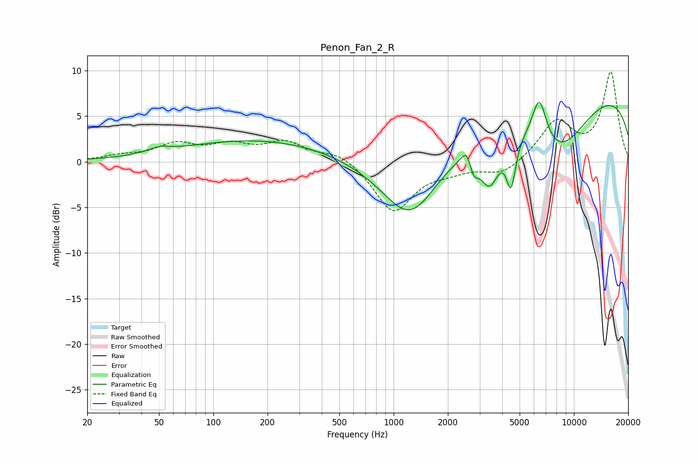

# Penon_Fan_2_R
See [usage instructions](https://github.com/jaakkopasanen/AutoEq#usage) for more options and info.

### Parametric EQs
Apply preamp of -6.6 dB when using parametric equalizer.

|   # | Type    |   Fc (Hz) |    Q |   Gain (dB) |
|-----|---------|-----------|------|-------------|
|   1 | Peaking |        50 | 2.36 |         0.5 |
|   2 | Peaking |       180 | 0.32 |         2.4 |
|   3 | Peaking |      1242 | 0.87 |        -7.5 |
|   4 | Peaking |      2572 | 4.65 |         2.1 |
|   5 | Peaking |      2761 | 5.22 |        -2.5 |
|   6 | Peaking |      3406 | 2.54 |        -5.3 |
|   7 | Peaking |      4479 | 5.46 |        -5.1 |
|   8 | Peaking |      6426 | 3.31 |         5.1 |
|   9 | Peaking |      8133 | 0.74 |        -6.9 |
|  10 | Peaking |     10000 | 0.18 |         8.6 |

### Fixed Band EQs
When using fixed band (also called graphic) equalizer, apply preamp of **-9.9 dB** (if available) and set gains manually with these parameters.

|   # | Type    |   Fc (Hz) |    Q |   Gain (dB) |
|-----|---------|-----------|------|-------------|
|   1 | Peaking |        31 | 1.41 |         0.5 |
|   2 | Peaking |        62 | 1.41 |         1.8 |
|   3 | Peaking |       125 | 1.41 |         1.6 |
|   4 | Peaking |       250 | 1.41 |         2   |
|   5 | Peaking |       500 | 1.41 |         1.1 |
|   6 | Peaking |      1000 | 1.41 |        -5.5 |
|   7 | Peaking |      2000 | 1.41 |        -0.7 |
|   8 | Peaking |      4000 | 1.41 |        -1.5 |
|   9 | Peaking |      8000 | 1.41 |         4.3 |
|  10 | Peaking |     16000 | 1.41 |         9.7 |

### Graphs

