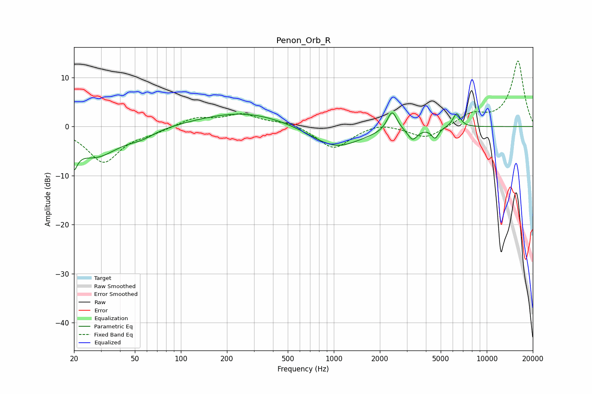

# Penon_Orb_R
See [usage instructions](https://github.com/jaakkopasanen/AutoEq#usage) for more options and info.

### Parametric EQs
Apply preamp of -2.9 dB when using parametric equalizer.

|   # | Type    |   Fc (Hz) |    Q |   Gain (dB) |
|-----|---------|-----------|------|-------------|
|   1 | Peaking |        20 | 5.84 |        -7.8 |
|   2 | Peaking |        20 | 5.98 |         3.2 |
|   3 | Peaking |        28 | 0.92 |        -6   |
|   4 | Peaking |        55 | 1.69 |        -1.2 |
|   5 | Peaking |       259 | 0.48 |         3   |
|   6 | Peaking |      1028 | 0.85 |        -4.6 |
|   7 | Peaking |      2403 | 4.5  |         4.2 |
|   8 | Peaking |      3273 | 4.53 |        -2.4 |
|   9 | Peaking |      4591 | 6    |        -2.2 |
|  10 | Peaking |      6357 | 5.57 |         2.9 |

### Fixed Band EQs
When using fixed band (also called graphic) equalizer, apply preamp of **-13.5 dB** (if available) and set gains manually with these parameters.

|   # | Type    |   Fc (Hz) |    Q |   Gain (dB) |
|-----|---------|-----------|------|-------------|
|   1 | Peaking |        31 | 1.41 |        -7.2 |
|   2 | Peaking |        62 | 1.41 |        -0.9 |
|   3 | Peaking |       125 | 1.41 |         1.8 |
|   4 | Peaking |       250 | 1.41 |         2.4 |
|   5 | Peaking |       500 | 1.41 |         0.9 |
|   6 | Peaking |      1000 | 1.41 |        -4.6 |
|   7 | Peaking |      2000 | 1.41 |         1   |
|   8 | Peaking |      4000 | 1.41 |        -2.5 |
|   9 | Peaking |      8000 | 1.41 |         2.4 |
|  10 | Peaking |     16000 | 1.41 |        13.4 |

### Graphs

