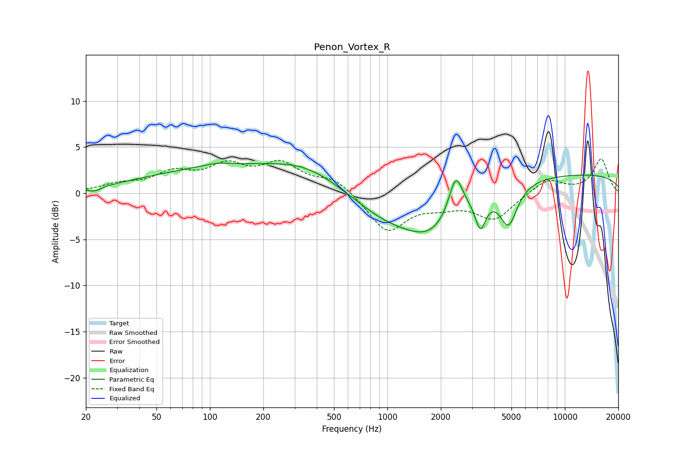

# Penon_Vortex_R
See [usage instructions](https://github.com/jaakkopasanen/AutoEq#usage) for more options and info.

### Parametric EQs
Apply preamp of -3.4 dB when using parametric equalizer.

|   # | Type    |   Fc (Hz) |    Q |   Gain (dB) |
|-----|---------|-----------|------|-------------|
|   1 | Peaking |        22 | 3.59 |        -0.5 |
|   2 | Peaking |       111 | 1.82 |         0.3 |
|   3 | Peaking |       124 | 0.3  |         2.7 |
|   4 | Peaking |       350 | 0.75 |         1.6 |
|   5 | Peaking |       972 | 0.75 |        -2.4 |
|   6 | Peaking |      1775 | 0.91 |        -4.2 |
|   7 | Peaking |      2426 | 3.62 |         4.3 |
|   8 | Peaking |      3346 | 4.67 |        -3.4 |
|   9 | Peaking |      4814 | 2.86 |        -4.4 |
|  10 | Peaking |     10000 | 0.18 |         2.1 |

### Fixed Band EQs
When using fixed band (also called graphic) equalizer, apply preamp of **-3.8 dB** (if available) and set gains manually with these parameters.

|   # | Type    |   Fc (Hz) |    Q |   Gain (dB) |
|-----|---------|-----------|------|-------------|
|   1 | Peaking |        31 | 1.41 |         0.8 |
|   2 | Peaking |        62 | 1.41 |         1.9 |
|   3 | Peaking |       125 | 1.41 |         2.6 |
|   4 | Peaking |       250 | 1.41 |         2.9 |
|   5 | Peaking |       500 | 1.41 |         1.6 |
|   6 | Peaking |      1000 | 1.41 |        -4.2 |
|   7 | Peaking |      2000 | 1.41 |        -1   |
|   8 | Peaking |      4000 | 1.41 |        -2.8 |
|   9 | Peaking |      8000 | 1.41 |         1.6 |
|  10 | Peaking |     16000 | 1.41 |         3.7 |

### Graphs

