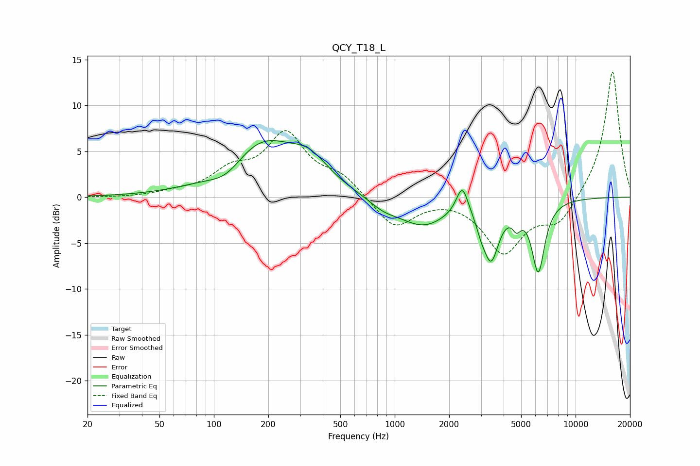

# QCY_T18_L
See [usage instructions](https://github.com/jaakkopasanen/AutoEq#usage) for more options and info.

### Parametric EQs
Apply preamp of -6.3 dB when using parametric equalizer.

|   # | Type    |   Fc (Hz) |    Q |   Gain (dB) |
|-----|---------|-----------|------|-------------|
|   1 | Peaking |       118 | 1.45 |        -1.8 |
|   2 | Peaking |       182 | 0.72 |         6.1 |
|   3 | Peaking |       338 | 1.37 |         2.4 |
|   4 | Peaking |       862 | 1.76 |        -0.9 |
|   5 | Peaking |      1431 | 1.02 |        -3   |
|   6 | Peaking |      2363 | 4.36 |         3.2 |
|   7 | Peaking |      3004 | 5.34 |        -1.1 |
|   8 | Peaking |      3409 | 3.27 |        -6   |
|   9 | Peaking |      4725 | 6    |        -1.5 |
|  10 | Peaking |      6220 | 3.88 |        -7.7 |

### Fixed Band EQs
When using fixed band (also called graphic) equalizer, apply preamp of **-13.7 dB** (if available) and set gains manually with these parameters.

|   # | Type    |   Fc (Hz) |    Q |   Gain (dB) |
|-----|---------|-----------|------|-------------|
|   1 | Peaking |        31 | 1.41 |        -0.1 |
|   2 | Peaking |        62 | 1.41 |         0.4 |
|   3 | Peaking |       125 | 1.41 |         2.4 |
|   4 | Peaking |       250 | 1.41 |         6.5 |
|   5 | Peaking |       500 | 1.41 |         2   |
|   6 | Peaking |      1000 | 1.41 |        -3.4 |
|   7 | Peaking |      2000 | 1.41 |         0.2 |
|   8 | Peaking |      4000 | 1.41 |        -5.9 |
|   9 | Peaking |      8000 | 1.41 |        -2.8 |
|  10 | Peaking |     16000 | 1.41 |        13.9 |

### Graphs

