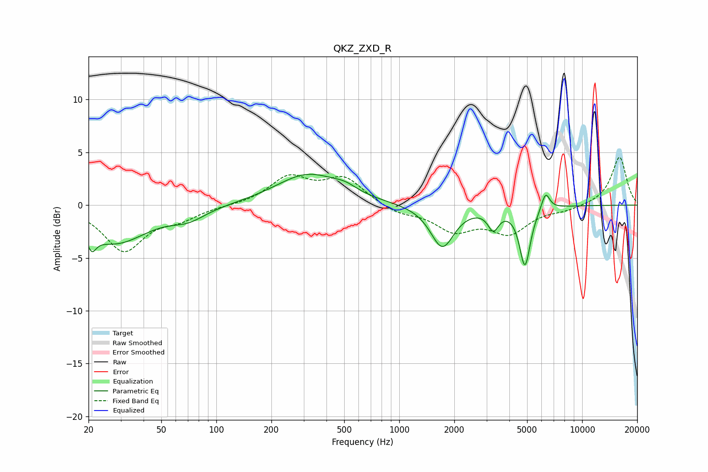

# QKZ_ZXD_R
See [usage instructions](https://github.com/jaakkopasanen/AutoEq#usage) for more options and info.

### Parametric EQs
Apply preamp of -3.0 dB when using parametric equalizer.

|   # | Type    |   Fc (Hz) |    Q |   Gain (dB) |
|-----|---------|-----------|------|-------------|
|   1 | Peaking |        21 | 5.94 |        -4.2 |
|   2 | Peaking |        21 | 6    |         2.7 |
|   3 | Peaking |        28 | 0.81 |        -3.5 |
|   4 | Peaking |        70 | 1.51 |        -1   |
|   5 | Peaking |       317 | 0.81 |         2.9 |
|   6 | Peaking |       507 | 2.18 |         0.6 |
|   7 | Peaking |      1720 | 2.21 |        -4   |
|   8 | Peaking |      3269 | 4.8  |        -1.8 |
|   9 | Peaking |      4867 | 4.69 |        -5.6 |
|  10 | Peaking |      6310 | 6    |         1.7 |

### Fixed Band EQs
When using fixed band (also called graphic) equalizer, apply preamp of **-4.6 dB** (if available) and set gains manually with these parameters.

|   # | Type    |   Fc (Hz) |    Q |   Gain (dB) |
|-----|---------|-----------|------|-------------|
|   1 | Peaking |        31 | 1.41 |        -4.2 |
|   2 | Peaking |        62 | 1.41 |        -1.1 |
|   3 | Peaking |       125 | 1.41 |        -0   |
|   4 | Peaking |       250 | 1.41 |         2.5 |
|   5 | Peaking |       500 | 1.41 |         2.5 |
|   6 | Peaking |      1000 | 1.41 |        -0.8 |
|   7 | Peaking |      2000 | 1.41 |        -2.2 |
|   8 | Peaking |      4000 | 1.41 |        -2.5 |
|   9 | Peaking |      8000 | 1.41 |        -0.4 |
|  10 | Peaking |     16000 | 1.41 |         4.6 |

### Graphs

