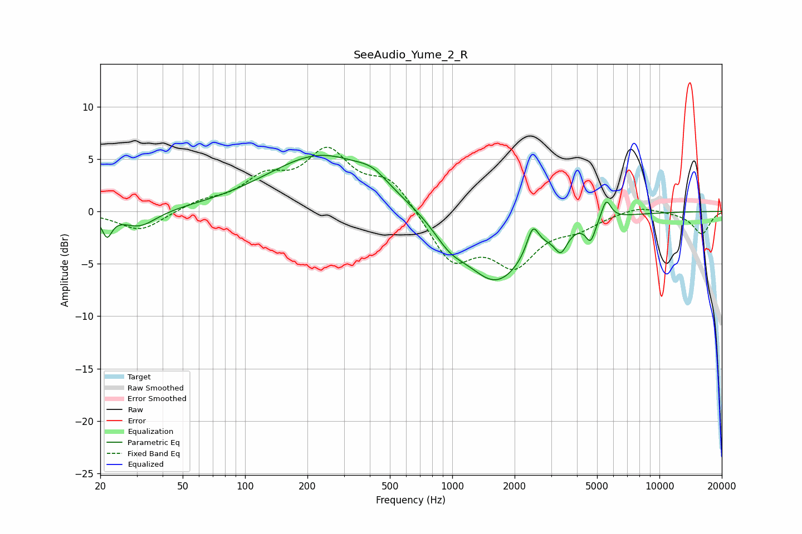

# SeeAudio_Yume_2_R
See [usage instructions](https://github.com/jaakkopasanen/AutoEq#usage) for more options and info.

### Parametric EQs
Apply preamp of -5.4 dB when using parametric equalizer.

|   # | Type    |   Fc (Hz) |    Q |   Gain (dB) |
|-----|---------|-----------|------|-------------|
|   1 | Peaking |        22 | 6    |        -2   |
|   2 | Peaking |        31 | 1.73 |        -1.6 |
|   3 | Peaking |       235 | 0.54 |         5.4 |
|   4 | Peaking |       412 | 1.97 |         1   |
|   5 | Peaking |       970 | 1.84 |        -1.6 |
|   6 | Peaking |      1630 | 0.91 |        -6.7 |
|   7 | Peaking |      2449 | 4.97 |         2.6 |
|   8 | Peaking |      3346 | 4.63 |        -1.9 |
|   9 | Peaking |      4654 | 6    |        -1.9 |
|  10 | Peaking |      5534 | 6    |         1.9 |

### Fixed Band EQs
When using fixed band (also called graphic) equalizer, apply preamp of **-6.2 dB** (if available) and set gains manually with these parameters.

|   # | Type    |   Fc (Hz) |    Q |   Gain (dB) |
|-----|---------|-----------|------|-------------|
|   1 | Peaking |        31 | 1.41 |        -1.9 |
|   2 | Peaking |        62 | 1.41 |         0.8 |
|   3 | Peaking |       125 | 1.41 |         2.7 |
|   4 | Peaking |       250 | 1.41 |         5.3 |
|   5 | Peaking |       500 | 1.41 |         2.9 |
|   6 | Peaking |      1000 | 1.41 |        -4.7 |
|   7 | Peaking |      2000 | 1.41 |        -4.6 |
|   8 | Peaking |      4000 | 1.41 |        -1.3 |
|   9 | Peaking |      8000 | 1.41 |         0.6 |
|  10 | Peaking |     16000 | 1.41 |        -2.1 |

### Graphs

