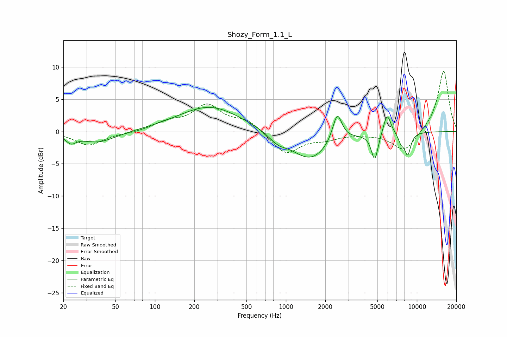

# Shozy_Form_1.1_L
See [usage instructions](https://github.com/jaakkopasanen/AutoEq#usage) for more options and info.

### Parametric EQs
Apply preamp of -3.8 dB when using parametric equalizer.

|   # | Type    |   Fc (Hz) |    Q |   Gain (dB) |
|-----|---------|-----------|------|-------------|
|   1 | Peaking |        23 | 3.83 |        -1.2 |
|   2 | Peaking |        37 | 1.04 |        -1.7 |
|   3 | Peaking |       263 | 0.59 |         3.9 |
|   4 | Peaking |       863 | 2.08 |        -1.2 |
|   5 | Peaking |      1534 | 0.96 |        -4.4 |
|   6 | Peaking |      2466 | 3.88 |         4.6 |
|   7 | Peaking |      4769 | 5.35 |        -4.3 |
|   8 | Peaking |      5930 | 4.8  |         3.3 |
|   9 | Peaking |      7586 | 5.98 |        -1.3 |
|  10 | Peaking |      8510 | 5.42 |        -3.3 |

### Fixed Band EQs
When using fixed band (also called graphic) equalizer, apply preamp of **-9.4 dB** (if available) and set gains manually with these parameters.

|   # | Type    |   Fc (Hz) |    Q |   Gain (dB) |
|-----|---------|-----------|------|-------------|
|   1 | Peaking |        31 | 1.41 |        -2.1 |
|   2 | Peaking |        62 | 1.41 |        -0.2 |
|   3 | Peaking |       125 | 1.41 |         1.3 |
|   4 | Peaking |       250 | 1.41 |         3.9 |
|   5 | Peaking |       500 | 1.41 |         1.7 |
|   6 | Peaking |      1000 | 1.41 |        -3.5 |
|   7 | Peaking |      2000 | 1.41 |        -0.9 |
|   8 | Peaking |      4000 | 1.41 |        -0.2 |
|   9 | Peaking |      8000 | 1.41 |        -3.2 |
|  10 | Peaking |     16000 | 1.41 |         9.5 |

### Graphs

