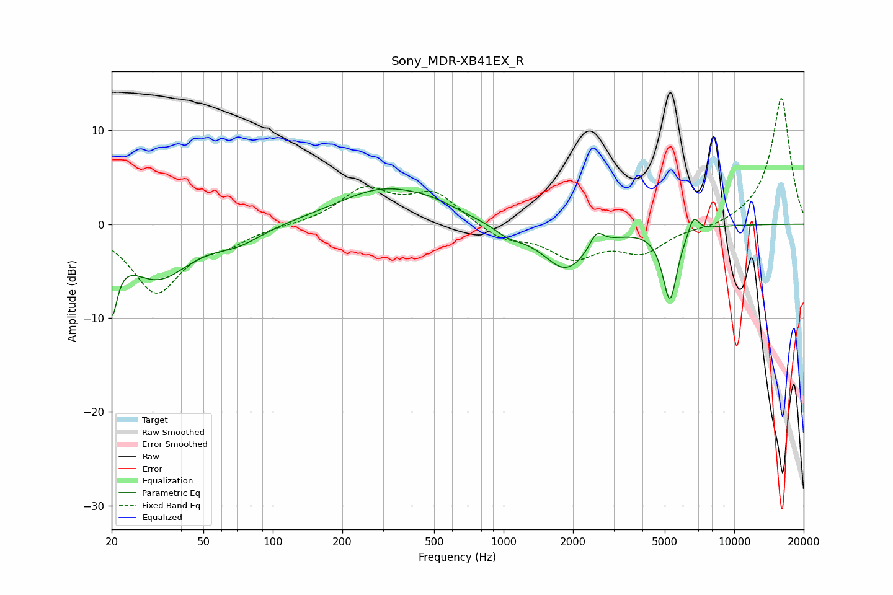

# Sony_MDR-XB41EX_R
See [usage instructions](https://github.com/jaakkopasanen/AutoEq#usage) for more options and info.

### Parametric EQs
Apply preamp of -3.9 dB when using parametric equalizer.

|   # | Type    |   Fc (Hz) |    Q |   Gain (dB) |
|-----|---------|-----------|------|-------------|
|   1 | Peaking |        20 | 5.97 |        -6.8 |
|   2 | Peaking |        32 | 0.99 |        -5.6 |
|   3 | Peaking |        71 | 1.35 |        -1.5 |
|   4 | Peaking |       305 | 0.69 |         3.8 |
|   5 | Peaking |       499 | 1.43 |         0.6 |
|   6 | Peaking |      1052 | 2.24 |        -1   |
|   7 | Peaking |      1862 | 1.36 |        -4.8 |
|   8 | Peaking |      2530 | 4.77 |         1.8 |
|   9 | Peaking |      5261 | 4.35 |        -7.8 |
|  10 | Peaking |      6663 | 5.99 |         1.9 |

### Fixed Band EQs
When using fixed band (also called graphic) equalizer, apply preamp of **-13.5 dB** (if available) and set gains manually with these parameters.

|   # | Type    |   Fc (Hz) |    Q |   Gain (dB) |
|-----|---------|-----------|------|-------------|
|   1 | Peaking |        31 | 1.41 |        -7.1 |
|   2 | Peaking |        62 | 1.41 |        -1.5 |
|   3 | Peaking |       125 | 1.41 |        -0   |
|   4 | Peaking |       250 | 1.41 |         3.6 |
|   5 | Peaking |       500 | 1.41 |         3.2 |
|   6 | Peaking |      1000 | 1.41 |        -1.6 |
|   7 | Peaking |      2000 | 1.41 |        -3.3 |
|   8 | Peaking |      4000 | 1.41 |        -2.8 |
|   9 | Peaking |      8000 | 1.41 |        -0.5 |
|  10 | Peaking |     16000 | 1.41 |        13.6 |

### Graphs

