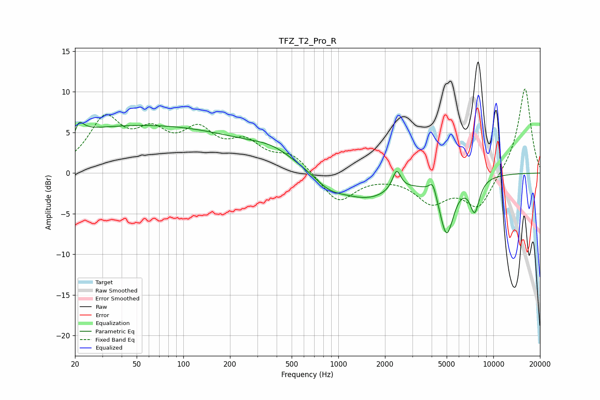

# TFZ_T2_Pro_R
See [usage instructions](https://github.com/jaakkopasanen/AutoEq#usage) for more options and info.

### Parametric EQs
Apply preamp of -6.3 dB when using parametric equalizer.

|   # | Type    |   Fc (Hz) |    Q |   Gain (dB) |
|-----|---------|-----------|------|-------------|
|   1 | Peaking |        20 | 5.96 |        -3.6 |
|   2 | Peaking |        20 | 4.77 |         4.1 |
|   3 | Peaking |        54 | 0.18 |         5.8 |
|   4 | Peaking |       377 | 0.94 |         1.5 |
|   5 | Peaking |       872 | 1.51 |        -1.3 |
|   6 | Peaking |      1525 | 0.75 |        -3   |
|   7 | Peaking |      2377 | 5.31 |         2.5 |
|   8 | Peaking |      4072 | 6    |         1.7 |
|   9 | Peaking |      4998 | 2.99 |        -6.9 |
|  10 | Peaking |      7581 | 4.22 |        -4   |

### Fixed Band EQs
When using fixed band (also called graphic) equalizer, apply preamp of **-10.5 dB** (if available) and set gains manually with these parameters.

|   # | Type    |   Fc (Hz) |    Q |   Gain (dB) |
|-----|---------|-----------|------|-------------|
|   1 | Peaking |        31 | 1.41 |         6.2 |
|   2 | Peaking |        62 | 1.41 |         3.9 |
|   3 | Peaking |       125 | 1.41 |         4.4 |
|   4 | Peaking |       250 | 1.41 |         3.2 |
|   5 | Peaking |       500 | 1.41 |         2.1 |
|   6 | Peaking |      1000 | 1.41 |        -3.7 |
|   7 | Peaking |      2000 | 1.41 |        -0.1 |
|   8 | Peaking |      4000 | 1.41 |        -3.3 |
|   9 | Peaking |      8000 | 1.41 |        -4.2 |
|  10 | Peaking |     16000 | 1.41 |        10.7 |

### Graphs

