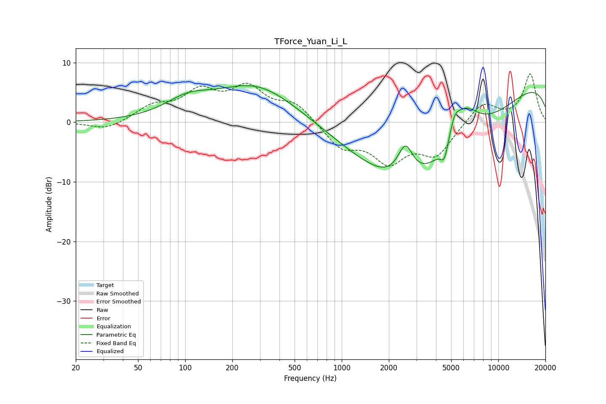

# TForce_Yuan_Li_L
See [usage instructions](https://github.com/jaakkopasanen/AutoEq#usage) for more options and info.

### Parametric EQs
Apply preamp of -6.2 dB when using parametric equalizer.

|   # | Type    |   Fc (Hz) |    Q |   Gain (dB) |
|-----|---------|-----------|------|-------------|
|   1 | Peaking |       104 | 0.96 |         2.7 |
|   2 | Peaking |       285 | 0.54 |         6.2 |
|   3 | Peaking |      2553 | 2.82 |         5.7 |
|   4 | Peaking |      2607 | 0.52 |        -5.1 |
|   5 | Peaking |      3501 | 0.26 |        -3.7 |
|   6 | Peaking |      4466 | 0.34 |        -8.5 |
|   7 | Peaking |      4523 | 5.79 |        -2.9 |
|   8 | Peaking |      5256 | 4.82 |         2.1 |
|   9 | Peaking |      5971 | 1.33 |         7.6 |
|  10 | Peaking |     10000 | 0.19 |         8.4 |

### Fixed Band EQs
When using fixed band (also called graphic) equalizer, apply preamp of **-8.2 dB** (if available) and set gains manually with these parameters.

|   # | Type    |   Fc (Hz) |    Q |   Gain (dB) |
|-----|---------|-----------|------|-------------|
|   1 | Peaking |        31 | 1.41 |        -1.4 |
|   2 | Peaking |        62 | 1.41 |         2.4 |
|   3 | Peaking |       125 | 1.41 |         4.6 |
|   4 | Peaking |       250 | 1.41 |         5.3 |
|   5 | Peaking |       500 | 1.41 |         3   |
|   6 | Peaking |      1000 | 1.41 |        -4   |
|   7 | Peaking |      2000 | 1.41 |        -6   |
|   8 | Peaking |      4000 | 1.41 |        -5.2 |
|   9 | Peaking |      8000 | 1.41 |         3.4 |
|  10 | Peaking |     16000 | 1.41 |         8.1 |

### Graphs

