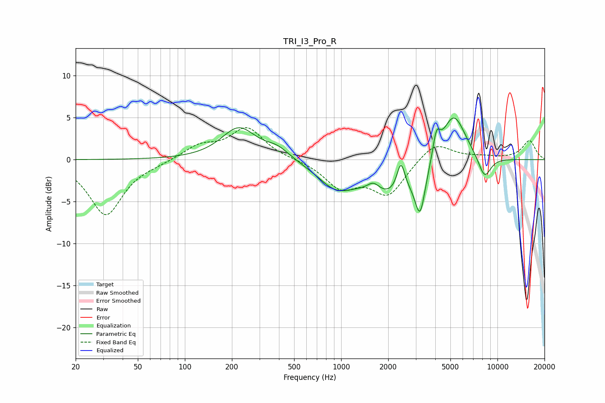

# TRI_I3_Pro_R
See [usage instructions](https://github.com/jaakkopasanen/AutoEq#usage) for more options and info.

### Parametric EQs
Apply preamp of -5.1 dB when using parametric equalizer.

|   # | Type    |   Fc (Hz) |    Q |   Gain (dB) |
|-----|---------|-----------|------|-------------|
|   1 | Peaking |       221 | 1.28 |         3.8 |
|   2 | Peaking |       391 | 1.8  |         1.2 |
|   3 | Peaking |       923 | 1.23 |        -2.6 |
|   4 | Peaking |      1610 | 3.64 |         1.1 |
|   5 | Peaking |      2166 | 0.78 |        -4.2 |
|   6 | Peaking |      2414 | 5.38 |         3.6 |
|   7 | Peaking |      3200 | 4.48 |        -5.1 |
|   8 | Peaking |      4070 | 6    |         2.9 |
|   9 | Peaking |      5232 | 1.73 |         6.3 |
|  10 | Peaking |      8266 | 3.17 |        -2.7 |

### Fixed Band EQs
When using fixed band (also called graphic) equalizer, apply preamp of **-3.9 dB** (if available) and set gains manually with these parameters.

|   # | Type    |   Fc (Hz) |    Q |   Gain (dB) |
|-----|---------|-----------|------|-------------|
|   1 | Peaking |        31 | 1.41 |        -6.6 |
|   2 | Peaking |        62 | 1.41 |        -0.3 |
|   3 | Peaking |       125 | 1.41 |         1.6 |
|   4 | Peaking |       250 | 1.41 |         3.7 |
|   5 | Peaking |       500 | 1.41 |         0   |
|   6 | Peaking |      1000 | 1.41 |        -3.1 |
|   7 | Peaking |      2000 | 1.41 |        -4.1 |
|   8 | Peaking |      4000 | 1.41 |         2.2 |
|   9 | Peaking |      8000 | 1.41 |         0.3 |
|  10 | Peaking |     16000 | 1.41 |         2.3 |

### Graphs

