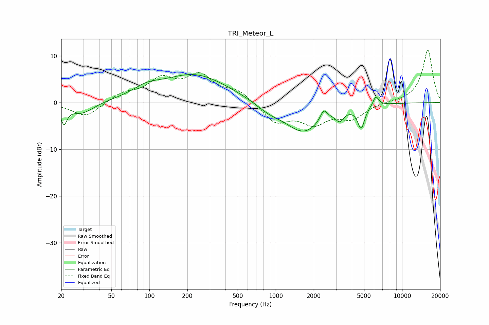

# TRI_Meteor_L
See [usage instructions](https://github.com/jaakkopasanen/AutoEq#usage) for more options and info.

### Parametric EQs
Apply preamp of -6.1 dB when using parametric equalizer.

|   # | Type    |   Fc (Hz) |    Q |   Gain (dB) |
|-----|---------|-----------|------|-------------|
|   1 | Peaking |        21 | 5.85 |        -3.7 |
|   2 | Peaking |        29 | 1.49 |        -2.5 |
|   3 | Peaking |        95 | 1.33 |         1.6 |
|   4 | Peaking |       228 | 0.52 |         6   |
|   5 | Peaking |       876 | 1.34 |        -1.5 |
|   6 | Peaking |      1661 | 0.95 |        -6.3 |
|   7 | Peaking |      2396 | 5    |         2.4 |
|   8 | Peaking |      3210 | 4.52 |        -2   |
|   9 | Peaking |      4745 | 5    |        -4.7 |
|  10 | Peaking |      6199 | 5.99 |         2.1 |

### Fixed Band EQs
When using fixed band (also called graphic) equalizer, apply preamp of **-11.3 dB** (if available) and set gains manually with these parameters.

|   # | Type    |   Fc (Hz) |    Q |   Gain (dB) |
|-----|---------|-----------|------|-------------|
|   1 | Peaking |        31 | 1.41 |        -3.1 |
|   2 | Peaking |        62 | 1.41 |         1.8 |
|   3 | Peaking |       125 | 1.41 |         4.5 |
|   4 | Peaking |       250 | 1.41 |         5.3 |
|   5 | Peaking |       500 | 1.41 |         2.3 |
|   6 | Peaking |      1000 | 1.41 |        -4.1 |
|   7 | Peaking |      2000 | 1.41 |        -4   |
|   8 | Peaking |      4000 | 1.41 |        -3.1 |
|   9 | Peaking |      8000 | 1.41 |         0.2 |
|  10 | Peaking |     16000 | 1.41 |        11.3 |

### Graphs

