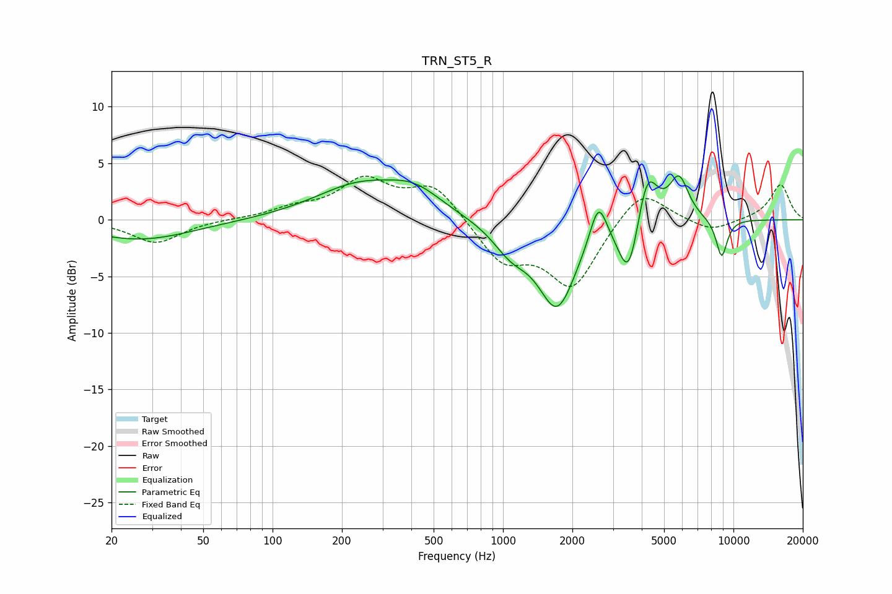

# TRN_ST5_R
See [usage instructions](https://github.com/jaakkopasanen/AutoEq#usage) for more options and info.

### Parametric EQs
Apply preamp of -4.0 dB when using parametric equalizer.

|   # | Type    |   Fc (Hz) |    Q |   Gain (dB) |
|-----|---------|-----------|------|-------------|
|   1 | Peaking |        27 | 0.63 |        -1.8 |
|   2 | Peaking |       237 | 0.73 |         2.9 |
|   3 | Peaking |       415 | 1.2  |         1.9 |
|   4 | Peaking |      1083 | 1.79 |        -2.1 |
|   5 | Peaking |      1718 | 1.68 |        -7.5 |
|   6 | Peaking |      2595 | 3.8  |         3.9 |
|   7 | Peaking |      3517 | 3.08 |        -5.5 |
|   8 | Peaking |      4218 | 3.06 |         5.2 |
|   9 | Peaking |      5806 | 3.26 |         3.7 |
|  10 | Peaking |      8889 | 5.16 |        -3.4 |

### Fixed Band EQs
When using fixed band (also called graphic) equalizer, apply preamp of **-4.0 dB** (if available) and set gains manually with these parameters.

|   # | Type    |   Fc (Hz) |    Q |   Gain (dB) |
|-----|---------|-----------|------|-------------|
|   1 | Peaking |        31 | 1.41 |        -2.1 |
|   2 | Peaking |        62 | 1.41 |         0   |
|   3 | Peaking |       125 | 1.41 |         0.8 |
|   4 | Peaking |       250 | 1.41 |         3.3 |
|   5 | Peaking |       500 | 1.41 |         3   |
|   6 | Peaking |      1000 | 1.41 |        -3.5 |
|   7 | Peaking |      2000 | 1.41 |        -5.9 |
|   8 | Peaking |      4000 | 1.41 |         3.1 |
|   9 | Peaking |      8000 | 1.41 |        -1.1 |
|  10 | Peaking |     16000 | 1.41 |         3.1 |

### Graphs

