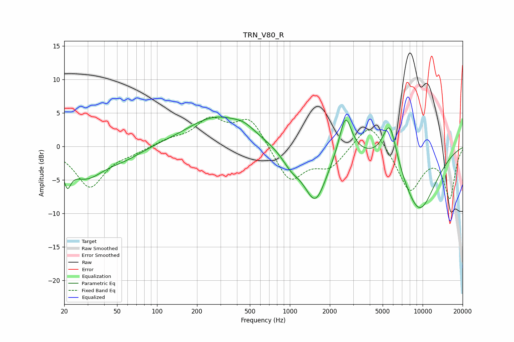

# TRN_V80_R
See [usage instructions](https://github.com/jaakkopasanen/AutoEq#usage) for more options and info.

### Parametric EQs
Apply preamp of -4.5 dB when using parametric equalizer.

|   # | Type    |   Fc (Hz) |    Q |   Gain (dB) |
|-----|---------|-----------|------|-------------|
|   1 | Peaking |        21 | 5.34 |        -3.1 |
|   2 | Peaking |        29 | 1.03 |        -4.3 |
|   3 | Peaking |        57 | 1    |        -1.3 |
|   4 | Peaking |       279 | 0.64 |         4.4 |
|   5 | Peaking |       454 | 1.74 |         1   |
|   6 | Peaking |      1025 | 2    |        -1.9 |
|   7 | Peaking |      1556 | 1.61 |        -8   |
|   8 | Peaking |      2622 | 2.99 |         6.4 |
|   9 | Peaking |      5654 | 2.53 |         6.9 |
|  10 | Peaking |      9388 | 0.9  |        -9.7 |

### Fixed Band EQs
When using fixed band (also called graphic) equalizer, apply preamp of **-4.5 dB** (if available) and set gains manually with these parameters.

|   # | Type    |   Fc (Hz) |    Q |   Gain (dB) |
|-----|---------|-----------|------|-------------|
|   1 | Peaking |        31 | 1.41 |        -6   |
|   2 | Peaking |        62 | 1.41 |        -0.7 |
|   3 | Peaking |       125 | 1.41 |         0.9 |
|   4 | Peaking |       250 | 1.41 |         3.7 |
|   5 | Peaking |       500 | 1.41 |         4.3 |
|   6 | Peaking |      1000 | 1.41 |        -5.3 |
|   7 | Peaking |      2000 | 1.41 |        -2.9 |
|   8 | Peaking |      4000 | 1.41 |         4.2 |
|   9 | Peaking |      8000 | 1.41 |        -6.6 |
|  10 | Peaking |     16000 | 1.41 |        -7.5 |

### Graphs

