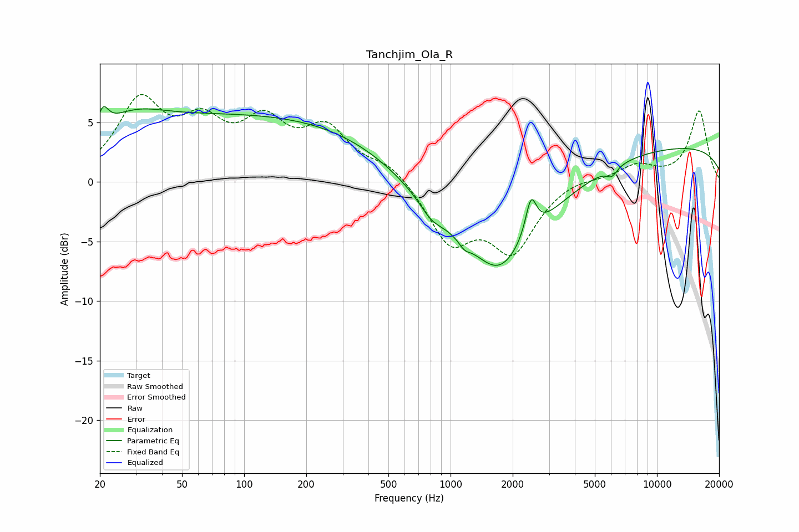

# Tanchjim_Ola_R
See [usage instructions](https://github.com/jaakkopasanen/AutoEq#usage) for more options and info.

### Parametric EQs
Apply preamp of -6.4 dB when using parametric equalizer.

|   # | Type    |   Fc (Hz) |    Q |   Gain (dB) |
|-----|---------|-----------|------|-------------|
|   1 | Peaking |        21 | 5.43 |         1.8 |
|   2 | Peaking |        28 | 0.87 |         2.4 |
|   3 | Peaking |       124 | 0.18 |         5.5 |
|   4 | Peaking |       804 | 2.65 |        -0.9 |
|   5 | Peaking |      1168 | 5.7  |        -0.5 |
|   6 | Peaking |      1584 | 0.46 |        -6.8 |
|   7 | Peaking |      1736 | 1.47 |        -2.3 |
|   8 | Peaking |      2455 | 5.44 |         3.1 |
|   9 | Peaking |      6045 | 5.28 |        -0.8 |
|  10 | Peaking |     10000 | 0.18 |         3.1 |

### Fixed Band EQs
When using fixed band (also called graphic) equalizer, apply preamp of **-7.4 dB** (if available) and set gains manually with these parameters.

|   # | Type    |   Fc (Hz) |    Q |   Gain (dB) |
|-----|---------|-----------|------|-------------|
|   1 | Peaking |        31 | 1.41 |         6.4 |
|   2 | Peaking |        62 | 1.41 |         4   |
|   3 | Peaking |       125 | 1.41 |         4.3 |
|   4 | Peaking |       250 | 1.41 |         4   |
|   5 | Peaking |       500 | 1.41 |         1.5 |
|   6 | Peaking |      1000 | 1.41 |        -4.9 |
|   7 | Peaking |      2000 | 1.41 |        -5.5 |
|   8 | Peaking |      4000 | 1.41 |         0.5 |
|   9 | Peaking |      8000 | 1.41 |         1.4 |
|  10 | Peaking |     16000 | 1.41 |         5.9 |

### Graphs

