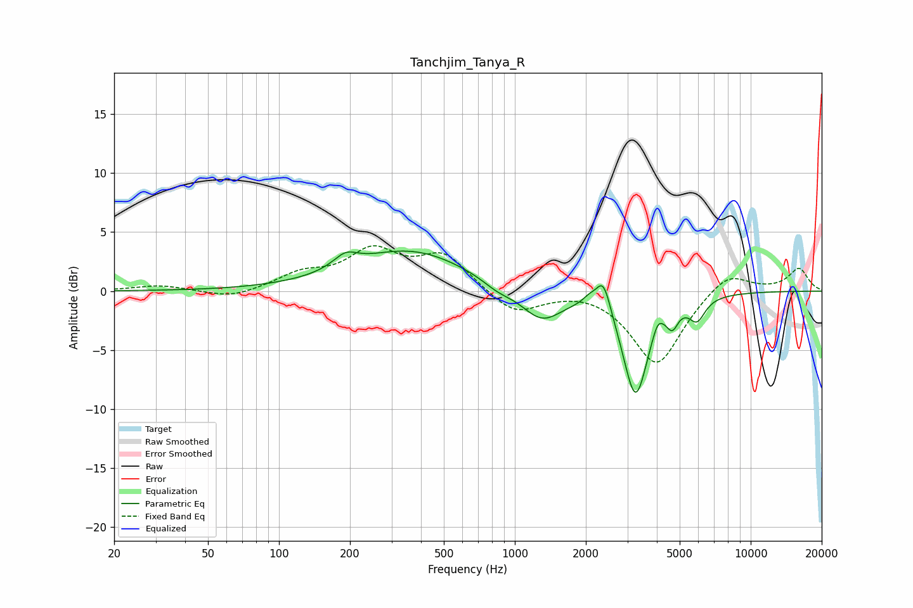

# Tanchjim_Tanya_R
See [usage instructions](https://github.com/jaakkopasanen/AutoEq#usage) for more options and info.

### Parametric EQs
Apply preamp of -3.5 dB when using parametric equalizer.

|   # | Type    |   Fc (Hz) |    Q |   Gain (dB) |
|-----|---------|-----------|------|-------------|
|   1 | Peaking |       191 | 2.73 |         1.1 |
|   2 | Peaking |       359 | 0.58 |         3.4 |
|   3 | Peaking |       841 | 2.2  |        -0.6 |
|   4 | Peaking |      1299 | 1.6  |        -2.7 |
|   5 | Peaking |      2065 | 5.1  |         0.5 |
|   6 | Peaking |      2374 | 4.49 |         2.8 |
|   7 | Peaking |      3249 | 2.61 |        -8.8 |
|   8 | Peaking |      4031 | 6    |         1.2 |
|   9 | Peaking |      4656 | 5.98 |        -1.5 |
|  10 | Peaking |      5924 | 4.05 |        -1.8 |

### Fixed Band EQs
When using fixed band (also called graphic) equalizer, apply preamp of **-3.9 dB** (if available) and set gains manually with these parameters.

|   # | Type    |   Fc (Hz) |    Q |   Gain (dB) |
|-----|---------|-----------|------|-------------|
|   1 | Peaking |        31 | 1.41 |         0.5 |
|   2 | Peaking |        62 | 1.41 |        -0.7 |
|   3 | Peaking |       125 | 1.41 |         1.3 |
|   4 | Peaking |       250 | 1.41 |         3.2 |
|   5 | Peaking |       500 | 1.41 |         2.9 |
|   6 | Peaking |      1000 | 1.41 |        -2   |
|   7 | Peaking |      2000 | 1.41 |         0.3 |
|   8 | Peaking |      4000 | 1.41 |        -6.3 |
|   9 | Peaking |      8000 | 1.41 |         1.8 |
|  10 | Peaking |     16000 | 1.41 |         1.9 |

### Graphs

