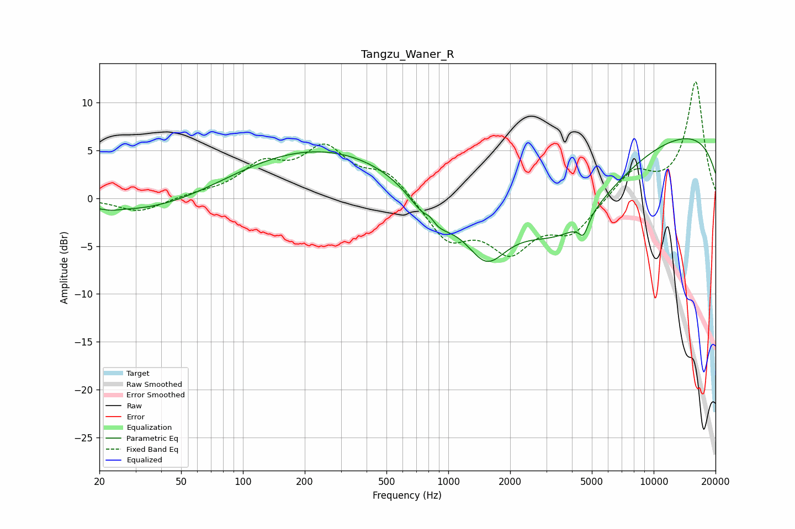

# Tangzu_Waner_R
See [usage instructions](https://github.com/jaakkopasanen/AutoEq#usage) for more options and info.

### Parametric EQs
Apply preamp of -6.3 dB when using parametric equalizer.

|   # | Type    |   Fc (Hz) |    Q |   Gain (dB) |
|-----|---------|-----------|------|-------------|
|   1 | Peaking |        23 | 5.16 |        -0.1 |
|   2 | Peaking |        93 | 0.23 |        -3.8 |
|   3 | Peaking |       195 | 0.28 |         1.6 |
|   4 | Peaking |       199 | 0.32 |         6.7 |
|   5 | Peaking |       813 | 5.94 |         0.7 |
|   6 | Peaking |       835 | 1.41 |        -3.6 |
|   7 | Peaking |      1529 | 1.4  |        -5.3 |
|   8 | Peaking |      3663 | 0.54 |        -8.9 |
|   9 | Peaking |      4555 | 5.97 |        -1.8 |
|  10 | Peaking |     10000 | 0.18 |         7.6 |

### Fixed Band EQs
When using fixed band (also called graphic) equalizer, apply preamp of **-12.3 dB** (if available) and set gains manually with these parameters.

|   # | Type    |   Fc (Hz) |    Q |   Gain (dB) |
|-----|---------|-----------|------|-------------|
|   1 | Peaking |        31 | 1.41 |        -1.5 |
|   2 | Peaking |        62 | 1.41 |         0.3 |
|   3 | Peaking |       125 | 1.41 |         3.1 |
|   4 | Peaking |       250 | 1.41 |         4.8 |
|   5 | Peaking |       500 | 1.41 |         2.6 |
|   6 | Peaking |      1000 | 1.41 |        -4.2 |
|   7 | Peaking |      2000 | 1.41 |        -5   |
|   8 | Peaking |      4000 | 1.41 |        -3.3 |
|   9 | Peaking |      8000 | 1.41 |         2.8 |
|  10 | Peaking |     16000 | 1.41 |        12.2 |

### Graphs

