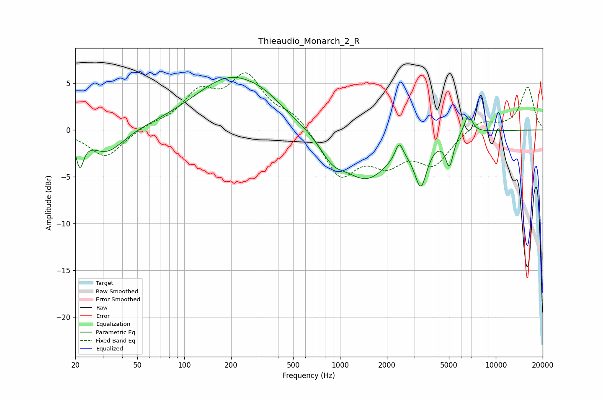

# Thieaudio_Monarch_2_R
See [usage instructions](https://github.com/jaakkopasanen/AutoEq#usage) for more options and info.

### Parametric EQs
Apply preamp of -5.7 dB when using parametric equalizer.

|   # | Type    |   Fc (Hz) |    Q |   Gain (dB) |
|-----|---------|-----------|------|-------------|
|   1 | Peaking |        21 | 5.95 |        -3   |
|   2 | Peaking |        32 | 1.32 |        -2.6 |
|   3 | Peaking |       201 | 0.59 |         5.6 |
|   4 | Peaking |       330 | 1.45 |         0.6 |
|   5 | Peaking |       891 | 1.78 |        -2   |
|   6 | Peaking |      1477 | 0.92 |        -5   |
|   7 | Peaking |      2396 | 5.73 |         1.8 |
|   8 | Peaking |      3301 | 3.52 |        -4.7 |
|   9 | Peaking |      5038 | 5.67 |        -3.2 |
|  10 | Peaking |      6654 | 4.88 |         2.1 |

### Fixed Band EQs
When using fixed band (also called graphic) equalizer, apply preamp of **-6.2 dB** (if available) and set gains manually with these parameters.

|   # | Type    |   Fc (Hz) |    Q |   Gain (dB) |
|-----|---------|-----------|------|-------------|
|   1 | Peaking |        31 | 1.41 |        -3   |
|   2 | Peaking |        62 | 1.41 |         0.5 |
|   3 | Peaking |       125 | 1.41 |         3.6 |
|   4 | Peaking |       250 | 1.41 |         5.4 |
|   5 | Peaking |       500 | 1.41 |         1.6 |
|   6 | Peaking |      1000 | 1.41 |        -4.9 |
|   7 | Peaking |      2000 | 1.41 |        -3   |
|   8 | Peaking |      4000 | 1.41 |        -3.4 |
|   9 | Peaking |      8000 | 1.41 |         1.1 |
|  10 | Peaking |     16000 | 1.41 |         4.6 |

### Graphs

