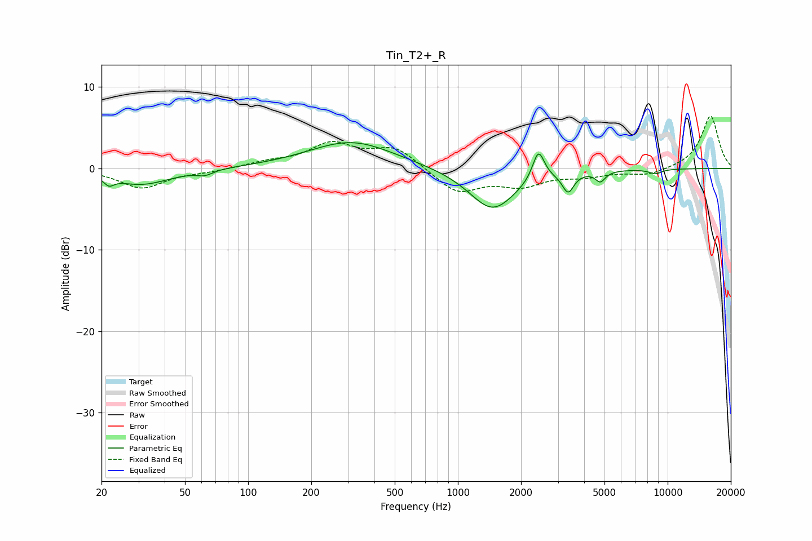

# Tin_T2+_R
See [usage instructions](https://github.com/jaakkopasanen/AutoEq#usage) for more options and info.

### Parametric EQs
Apply preamp of -3.3 dB when using parametric equalizer.

|   # | Type    |   Fc (Hz) |    Q |   Gain (dB) |
|-----|---------|-----------|------|-------------|
|   1 | Peaking |        22 | 5.99 |         1.4 |
|   2 | Peaking |        22 | 5.99 |        -2.3 |
|   3 | Peaking |        31 | 1.03 |        -2   |
|   4 | Peaking |        62 | 3.79 |        -0.6 |
|   5 | Peaking |       311 | 0.69 |         3.3 |
|   6 | Peaking |      1463 | 1.27 |        -5.2 |
|   7 | Peaking |      2421 | 5.03 |         3.7 |
|   8 | Peaking |      3353 | 5.14 |        -2.4 |
|   9 | Peaking |      4778 | 6    |        -1.3 |
|  10 | Peaking |      8739 | 4.08 |        -0.6 |

### Fixed Band EQs
When using fixed band (also called graphic) equalizer, apply preamp of **-6.5 dB** (if available) and set gains manually with these parameters.

|   # | Type    |   Fc (Hz) |    Q |   Gain (dB) |
|-----|---------|-----------|------|-------------|
|   1 | Peaking |        31 | 1.41 |        -2.4 |
|   2 | Peaking |        62 | 1.41 |        -0.3 |
|   3 | Peaking |       125 | 1.41 |         0.6 |
|   4 | Peaking |       250 | 1.41 |         2.9 |
|   5 | Peaking |       500 | 1.41 |         2.5 |
|   6 | Peaking |      1000 | 1.41 |        -3   |
|   7 | Peaking |      2000 | 1.41 |        -1.9 |
|   8 | Peaking |      4000 | 1.41 |        -0.8 |
|   9 | Peaking |      8000 | 1.41 |        -0.8 |
|  10 | Peaking |     16000 | 1.41 |         6.5 |

### Graphs

