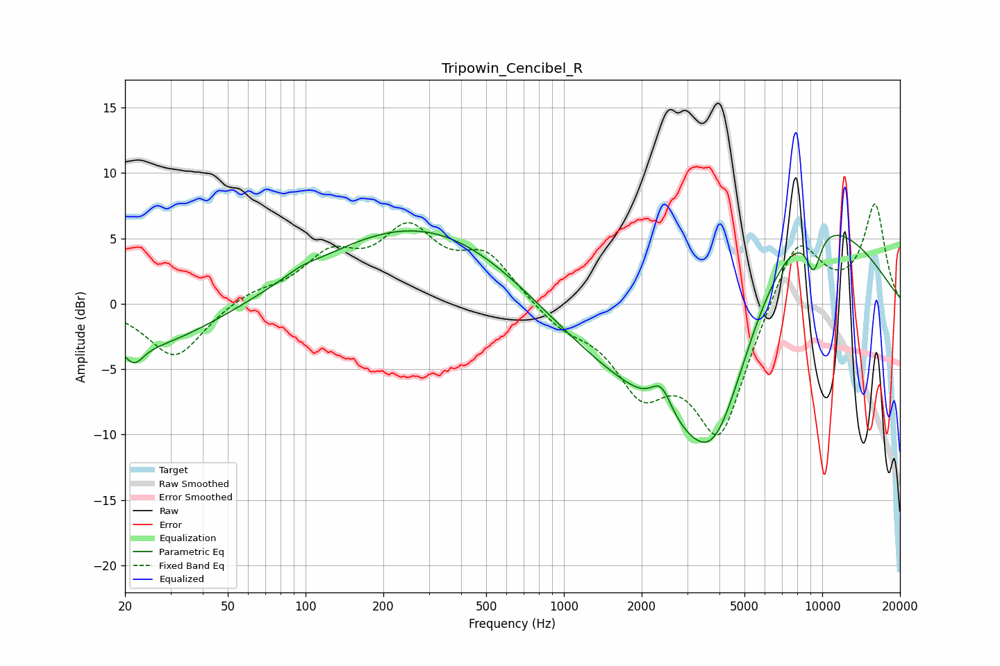

# Tripowin_Cencibel_R
See [usage instructions](https://github.com/jaakkopasanen/AutoEq#usage) for more options and info.

### Parametric EQs
Apply preamp of -5.7 dB when using parametric equalizer.

|   # | Type    |   Fc (Hz) |    Q |   Gain (dB) |
|-----|---------|-----------|------|-------------|
|   1 | Peaking |        22 | 4.18 |        -1.3 |
|   2 | Peaking |        23 | 0.49 |        -3.5 |
|   3 | Peaking |        96 | 2.54 |         0.3 |
|   4 | Peaking |       449 | 0.28 |         9.7 |
|   5 | Peaking |      1506 | 0.29 |       -10.1 |
|   6 | Peaking |      2381 | 3.42 |         2.4 |
|   7 | Peaking |      2642 | 1.12 |        -1.2 |
|   8 | Peaking |      3833 | 0.9  |       -12.3 |
|   9 | Peaking |      7043 | 0.39 |        11   |
|  10 | Peaking |      9268 | 4.43 |        -3   |

### Fixed Band EQs
When using fixed band (also called graphic) equalizer, apply preamp of **-7.7 dB** (if available) and set gains manually with these parameters.

|   # | Type    |   Fc (Hz) |    Q |   Gain (dB) |
|-----|---------|-----------|------|-------------|
|   1 | Peaking |        31 | 1.41 |        -4.2 |
|   2 | Peaking |        62 | 1.41 |         0.9 |
|   3 | Peaking |       125 | 1.41 |         3.3 |
|   4 | Peaking |       250 | 1.41 |         5.1 |
|   5 | Peaking |       500 | 1.41 |         3.5 |
|   6 | Peaking |      1000 | 1.41 |        -1.5 |
|   7 | Peaking |      2000 | 1.41 |        -5.7 |
|   8 | Peaking |      4000 | 1.41 |        -9.9 |
|   9 | Peaking |      8000 | 1.41 |         5.6 |
|  10 | Peaking |     16000 | 1.41 |         7.5 |

### Graphs

