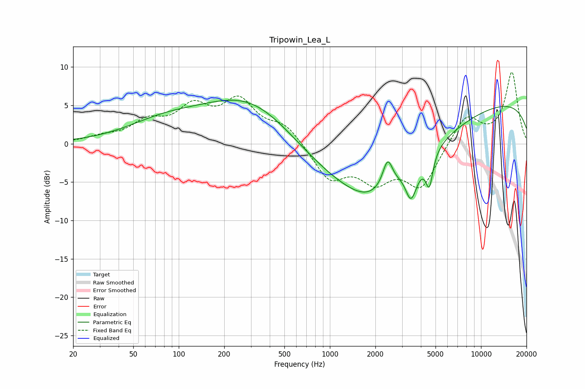

# Tripowin_Lea_L
See [usage instructions](https://github.com/jaakkopasanen/AutoEq#usage) for more options and info.

### Parametric EQs
Apply preamp of -5.8 dB when using parametric equalizer.

|   # | Type    |   Fc (Hz) |    Q |   Gain (dB) |
|-----|---------|-----------|------|-------------|
|   1 | Peaking |        78 | 0.57 |         2.2 |
|   2 | Peaking |       311 | 0.44 |         6.8 |
|   3 | Peaking |      1797 | 0.28 |        -7.3 |
|   4 | Peaking |      1871 | 0.86 |        -2.6 |
|   5 | Peaking |      2411 | 4.34 |         3.6 |
|   6 | Peaking |      3225 | 2.88 |         1.3 |
|   7 | Peaking |      3427 | 3.29 |        -5.5 |
|   8 | Peaking |      4242 | 0.38 |        -0.1 |
|   9 | Peaking |      4550 | 5.88 |        -4.1 |
|  10 | Peaking |     10000 | 0.18 |         5.8 |

### Fixed Band EQs
When using fixed band (also called graphic) equalizer, apply preamp of **-9.4 dB** (if available) and set gains manually with these parameters.

|   # | Type    |   Fc (Hz) |    Q |   Gain (dB) |
|-----|---------|-----------|------|-------------|
|   1 | Peaking |        31 | 1.41 |         0.7 |
|   2 | Peaking |        62 | 1.41 |         2.5 |
|   3 | Peaking |       125 | 1.41 |         4.1 |
|   4 | Peaking |       250 | 1.41 |         5.1 |
|   5 | Peaking |       500 | 1.41 |         2.3 |
|   6 | Peaking |      1000 | 1.41 |        -4.4 |
|   7 | Peaking |      2000 | 1.41 |        -4.2 |
|   8 | Peaking |      4000 | 1.41 |        -5.5 |
|   9 | Peaking |      8000 | 1.41 |         3.8 |
|  10 | Peaking |     16000 | 1.41 |         9.2 |

### Graphs

